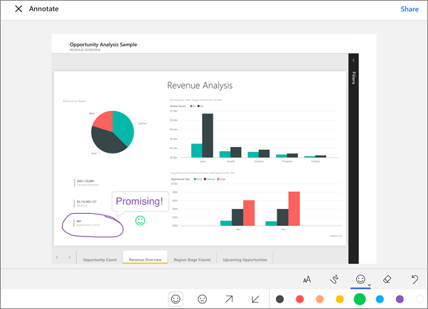
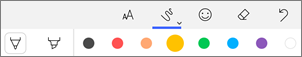
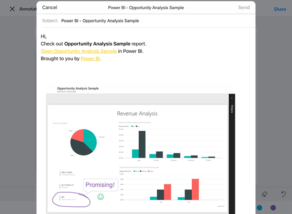

<properties 
   pageTitle="Annotate and share a tile, report, or visualization from the Power BI mobile app for iOS on the iPhone"
   description="Read about annotating and sharing tiles, reports, and visualizations from the Microsoft Power BI app for iOS on the iPhone. "
   services="powerbi" 
   documentationCenter="" 
   authors="maggiesMSFT" 
   manager="mblythe" 
   backup=""
   editor=""
   tags=""
   qualityFocus="no"
   qualityDate=""/>
 
<tags
   ms.service="powerbi"
   ms.devlang="NA"
   ms.topic="article"
   ms.tgt_pltfrm="NA"
   ms.workload="powerbi"
   ms.date="12/16/2016"
   ms.author="maggies"/>

# Annotate and share a tile, report, or visualization from the Power BI mobile app for iOS on the iPhone

You can share a snapshot of a tile, report, or visualization from the Power BI mobile app for iOS. Your recipients see it exactly as it was when you sent the mail, plus a link. You can send snapshots of tiles to anyone — not just colleagues in the same email domain. If they have permissions and you've already shared the dashboard or report with them, then they can click the link and go straight to that tile, report, or visualization. 
You can add annotations — lines, text, or stamps — before you share it.

*A report with annotations*

## Open a tile for annotating

1.  Tap the tile to open it in focus mode.

2.  Tap the annotate icon  in the upper-right corner of the tile.

3.  You're ready to [annotate and share the tile](powerbi-mobile-annotate-and-share-a-tile-from-the-iphone-app.md#annotate-and-share-the-tile-report-or-visualization).

## Open a report for annotating

1. Open a report. 

2.  Tap the annotate icon  in the upper-right corner of the report.

3.  You're ready to [annotate and share the report](powerbi-mobile-annotate-and-share-a-tile-from-the-iphone-app.md#annotate-and-share-the-tile-report-or-visualization).

## Open a visualization for annotating

1. In a report, tap a visualization, then tap the expand icon to open it in focus mode. 

    

2.  Tap the annotate icon  in the upper-right corner of the visualization.

3.  You're ready to [annotate and share the visualization](powerbi-mobile-annotate-and-share-a-tile-from-the-iphone-app.md#annotate-and-share-the-tile-report-or-visualization).

## Annotate and share the tile, report, or visualization

3.  Here's how you annotate:  

    

    -   To draw lines of different colors and thicknesses, tap the squiggly-line icon, choose a width and color, and draw.  

    -   To type comments, tap the **AA**, choose the text size and color, and type.  

    -   To paste stamps (like emoticons) on the tile, tap the smiley face, choose a color, and tap where you want them.   

4. After annotating, tap **Share** in the upper-right corner.

4.  Tap the Mail icon, type the recipients' names, and modify the message, if you want.  

    

    The mail has a link to the specific tile, report, or visualization. If your recipients have permissions and you've already shared the dashboard or report with them, then they can click the link and go straight to that tile, report, or visualization.

5.  Tap **Send**.

## See also

- [Share a dashboard from the iPhone app \(Power BI for iOS\)](powerbi-mobile-share-a-dashboard-from-the-iphone-app.md)
- [Share dashboards from the iPad app](powerbi-mobile-share-dashboards-from-the-ipad-app.md)
- Questions? [Try asking the Power BI Community](http://community.powerbi.com/)
