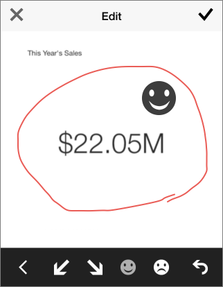
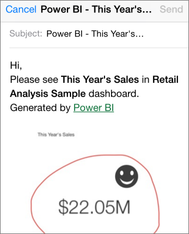

<properties pageTitle="Annotate and share a tile from the iPhone app (Power BI for iOS)" description="Annotate and share a tile from the iPhone app (Power BI for iOS)" services="powerbi" documentationCenter="" authors="v-anpasi" manager="mblythe" editor=""/>
<tags ms.service="powerbi" ms.devlang="NA" ms.topic="article" ms.tgt_pltfrm="NA" ms.workload="powerbi" ms.date="06/26/2015" ms.author="v-anpasi"/>
# Annotate and share a tile from the iPhone app (Power BI for iOS)

[← iPhone app (Power BI for iOS)](https://support.powerbi.com/knowledgebase/topics/78002-iphone-app-power-bi-for-ios-preview)

When you share a snapshot of a tile from the iPhone app for Microsoft Power BI for iOS, your recipients see the snapshot of the tile exactly as it was when you sent the mail. They can't open the dashboard. You can send snapshots of tiles to anyone — not just colleagues in the same email domain.

You can add annotations — lines, text, or stamps — to a tile before you share a snapshot.

1.  Tap a tile to interact with it.

2.  Tap the share icon  in the upper-right corner of the tile.

3.  To annotate the tile, tap an icon in the lower bar in the Edit window:

    

    -   Tap the pencil icon to draw lines of different colors and thicknesses.  
        

    -   Tap the text balloon to type comments.

    -   Tap the smiley face to paste stamps (like emoticons) on the tile.

4.  After annotating, tap the check mark in the upper-right corner.

5.  Tap the **Mail** icon, type the recipients' names, and modify the message, if you want.

    

6.  Tap **Send**.

## See Also

[Share a dashboard from the iPhone app (Power BI for iOS]  
[Get started with the iPhone app for Power BI](https://support.office.com/en-us/article/Get-started-with-the-iPhone-app-for-Power-BI-preview-f4001b4f-6b9a-4363-b97e-cb1ac5dfd3f6 "Get started with the iPhone app for Power BI")