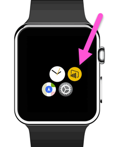

<properties 
   pageTitle="Power BI Apple Watch app"
   description="Power BI Apple Watch app"
   services="powerbi" 
   documentationCenter="" 
   authors="maggiesMSFT" 
   manager="mblythe" 
   backup=""
   editor=""
   tags=""
   qualityFocus="no"
   qualityDate=""/>
 
<tags
   ms.service="powerbi"
   ms.devlang="NA"
   ms.topic="article"
   ms.tgt_pltfrm="NA"
   ms.workload="powerbi"
   ms.date="03/28/2016"
   ms.author="maggies"/>

# Power BI Apple Watch app

With the Power BI Apple Watch app, you can view KPIs and card tiles from your Power BI dashboards, right on your watch. KPIs and card tiles are best suited to providing a heartbeat measure on the small screen. Check the blog post.
 
## Install the Apple Watch app
The Power BI Apple Watch app is bundled with the Power BI for iOS app, so when you [download the Power BI app to your iPhone](http://go.microsoft.com/fwlink/?LinkId=522062 "Download the iPhone app") from the Apple App Store, you're automatically also downloading the Power BI Watch app. The Apple guide explains how to [install Apple Watch applications](https://support.apple.com/en-us/HT204784).

## Sync your dashboard with Power BI on your Apple Watch
1. In Power BI on your iPhone, open the dashboard you want to sync with the Apple Watch. 

2. Select the ellipsis (...) > **Sync with Watch**.

Power BI shows an indicator that the dashboard is synced with the watch.

You can only sync one dashboard at a time with the watch.

> **Tip**: To view tiles from multiple dashboards on your watch, create a new dashboard in the Power BI service, and pin all the relevant tiles to it.

## Use the Power BI app on the Apple Watch
Get to the Power BI Apple Watch app either from the watch's springboard, or by clicking the Power BI *complication* (if configured) directly from the watch face.

*On the Apple Watch, complications are the tiny widgets near the time.* 

The Power BI Apple Watch app consists of two parts.

-   The **index screen** allows a quick overview of all KPI and card tiles from the synced dashboard.

    

-   The **in-focus tile**: Click a tile on the index screen for an in-depth view of a specific tile.

    
 
## Set a custom Power BI complication
You can also display a specific Power BI tile directly on the Apple Watch face, so it's visible and accessible at all times.

The Power BI Apple Watch complication updates close to the time your data updates, keeping your needed information always up to date.

### Add a Power BI complication to your watch face

See [Customize your Apple Watch face](https://support.apple.com/en-us/HT205536) in the Apple Guide.

### Change the text on the complication
Given the small space on the Apple Watch face, the Power BI Apple Watch app lets you change the title of the complication to fit the small space.

-   On your iPhone, go to the Apple Watch control app, select Power BI, navigate to the complication name field, and type a new name.

    

 
> **Note**: If you don't change the name, the Power BI complication will shorten the name to the number of characters that fit the small space on the watch face. 

### See also

Your feedback will help us decide what to implement in the future, so please don’t forget to vote for other features that you would like to see in Power BI mobile apps. 

-   Download the [Power BI iPhone mobile app](http://go.microsoft.com/fwlink/?LinkId=522062)
-   Follow [@MSPowerBI on Twitter](https://twitter.com/MSPowerBI)
-   Join the conversation at the [Power BI Community](http://community.powerbi.com/)

[Get started with the iPhone app for Power BI](powerbi-mobile-iphone-app-get-started.md)

[Get started with Power BI](powerbi-service-get-started.md)
