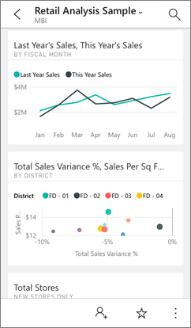
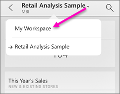
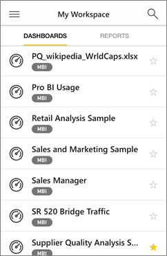
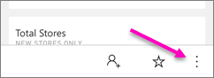
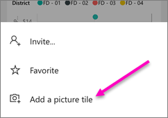
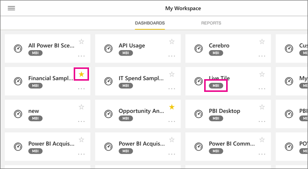

<properties 
   pageTitle="View dashboards in the Power BI mobile apps"
   description="You create or connect to dashboards in the Power BI service. Then you can view them in the Power BI mobile apps."
   services="powerbi" 
   documentationCenter="" 
   authors="maggiesMSFT" 
   manager="mblythe" 
   backup=""
   editor=""
   tags=""
   qualityFocus="complete"
   qualityDate="07/08/2016"/>
 
<tags
   ms.service="powerbi"
   ms.devlang="NA"
   ms.topic="article"
   ms.tgt_pltfrm="NA"
   ms.workload="powerbi"
   ms.date="01/12/2017"
   ms.author="maggies"/>
# View dashboards in the Power BI mobile apps

Dashboards are a portal to your company's life cycle and processes. A dashboard is an overview, a single place to monitor the current state of the business.

## Create dashboards in the Power BI service
**You don't create dashboards in the mobile apps.** 

To see more dashboards on your mobile device, you need to create or connect to them on your computer. 

1. Go to the Power BI service ([https://www.powerbi.com](https://www.powerbi.com)) and [sign up for an account](powerbi-service-self-service-signup-for-power-bi.md).

2. [Create your own Power BI dashboards](powerbi-service-create-a-dashboard.md), or connect to existing [content packs for a variety of services](powerbi-content-packs-services.md).

Here's a Power BI dashboard in the Power BI service:

## View dashboards in the Power BI mobile apps

Then these same dashboards will appear automatically in your Power BI mobile app. Dashboards refresh in real time, automatically, so no need to manually refresh them.

Here's the same dashboard as seen on a mobile phone:

From here, you can:

- Share the dashboard with colleagues .
- [Make the dashboard one of your favorites](powerbi-mobile-favorites.md) .
- Tap the arrow next to the dashboard name to go back to My Workspace.

    

## View dashboards on your iPhone  
1.  Open the Power BI app on your iPhone and sign in.

    Need to [download the iPhone app](http://go.microsoft.com/fwlink/?LinkId=522062) from the Apple App Store?

3.  Tap a dashboard to open it.  

     

     -     The yellow stars  show which dashboards are favorites. 

     -     The notation below each dashboard name  shows how the data in each dashboard is classified. Read more about [data classification in Power BI](powerbi-service-data-classification.md).

    By default, Power BI dashboards look a little different on your iPhone. All the tiles appear the same size, and they're arranged one after another from top to bottom.

     

    >**Tip**: If you're the dashboard owner, in the Power BI service you can [create a view of the dashboard specifically for phones](powerbi-service-create-dashboard-phone-view.md) in portrait mode. 

     Or just turn your phone sideways to [view the dashboard in landscape mode](#view-dashboards-in-landscape-mode) on your phone.

     

4.  Swipe up and down to see all the tiles in the dashboard. You can:

    -   [Tap a tile](powerbi-mobile-tiles-in-the-iphone-app.md) to open it in focus mode and interact with it.

    -   [Interact with a report page tile](powerbi-mobile-report-page-tiles-in-the-iphone-app.md) in the iPhone app.

    -   Tap the star  to [make it a favorite](powerbi-mobile-favorites.md).

    -  Tap **Invite**  to [invite a colleague](powerbi-mobile-share-a-dashboard-from-the-iphone-app.md) to view your dashboard.

    -  Tap the ellipsis to open the dashboard menu...

        

        Then tap to [add a picture tile](powerbi-mobile-picture-tiles-in-the-iphone-app.md) to your dashboard.

        

    -  [Sync the dashboard with your Apple Watch](powerbi-mobile-apple-watch.md).

6.  To get back to the list of dashboards, tap the arrow next to the dashboard title, then tap **My Workspace**.

    

### View dashboards in landscape mode in your iPhone

Just turn your phone sideways to view dashboards in landscape mode. The dashboard layout changes from a series of tiles to a view of the whole dashboard&#151;you see all of the dashboard’s tiles just as they are in the Power BI service.

You can use the “pinch” gesture to zoom in and out on different areas of your dashboard, pan to navigate it. And you can still [tap a tile](powerbi-mobile-tiles-in-the-win10phone-app.md) to open the tile in focus mode and interact with your data.

## View dashboards on your iPad

1.  Open the Power BI app.

    Need to [download the iPad app](http://go.microsoft.com/fwlink/?LinkId=522062) from the Apple App Store first?

2.  Tap **Dashboards** at the top of the app.  

    

     -     The yellow stars  show which dashboards are favorites. 

     -     The notation below each dashboard name  shows how the data in each dashboard is classified. Read more about [data classification in Power BI](powerbi-service-data-classification.md).

3.  You can share a dashboard from your workspace. Tap the ellipsis (...) in the lower-right corner of the dashboard tile, and tap **Invite Others**.

    

4.  You can also tap a dashboard to open it and see the tiles in that dashboard. While on the dashboard you can interact with it:

    - [Tap a tile to interact](powerbi-mobile-tiles-in-the-ipad-app.md) with the tile.

    - [Open the reports](powerbi-mobile-reports-on-the-ipad-app.md) behind the tiles.

    - [Invite others to view the dashboard](powerbi-mobile-share-dashboards-from-the-ipad-app.md).

    - [Annotate and share a snapshot](powerbi-mobile-annotate-and-share-a-snapshot-from-the-ipad-app.md) of a tile.

4.  To go back to My Workspace, tap the name of the dashboard in the upper-left corner, then tap **My Workspace**.

    

## View dashboards on your Android phone  
1.  Open the Power BI app on your Android phone and sign in.

    Need to [download the Android app](http://go.microsoft.com/fwlink/?LinkID=544867) first?

3.  Tap a dashboard to open it.   

    

     -     Yellow stars  show which dashboards are favorites. 

     -     A notation below a dashboard name  shows how the data in each dashboard is classified. Read more about [data classification in Power BI](powerbi-service-data-classification.md).

    Power BI dashboards look a little different on your Android phone. All the tiles appear the same width, and they're arranged one after another from top to bottom.

    

     Or just turn your phone sideways to [view them in landscape mode](#view-dashboards-in-landscape-mode) on your phone.

    >**Tip**: If you're the dashboard owner, in the Power BI service you can [create a view of the dashboard specifically for phones](powerbi-service-create-dashboard-phone-view.md) in portrait mode. 

5.  While on the dashboard, you can tap the vertical ellipsis (...) next to the name to invite a colleague, refresh, or get information about the dashboard:

    

6.  Swipe up and down to see all the [tiles in the dashboard](powerbi-mobile-tiles-in-the-android-app.md). 

6.  To go back to the dashboards home page, tap the dashboard name to open the breadcrumb trail, then tap **My Workspace**.   

### View dashboards in landscape mode on your Android phone
You can also view dashboards in landscape mode, just by turning your phone. The dashboard layout changes from a series of tiles to a view of the whole dashboard &#151; you see all of the dashboard’s tiles laid out as they are in the Power BI service.

You can use the “pinch” gesture to zoom in and out on different areas of your dashboard, pan to navigate it. And you can still [tap a tile](powerbi-mobile-tiles-in-the-android-app.md) to open the tile in focus mode and interact with your data.

## View dashboards on your Android tablet  
1.  Open the Power BI app on your Android tablet and sign in.

    Need to [download the Android app](http://go.microsoft.com/fwlink/?LinkID=544867) first?

3.  Tap a dashboard to open it.   

    

     -     The yellow stars  show which dashboards are favorites. 

     -     The notation below each dashboard name  shows how the data in each dashboard is classified. Read more about [data classification in Power BI](powerbi-service-data-classification.md).

5.  While on the dashboard, you can tap the vertical ellipsis (...) next to the name to invite a colleague, refresh, or get information about the dashboard:

    

6.  Swipe up and down to see all the [tiles in the dashboard](powerbi-mobile-tiles-in-the-android-tablet-app.md). 

    You can use the “pinch” gesture to zoom in and out on different areas of your dashboard, pan to navigate it. And you can still [tap a tile](powerbi-mobile-tiles-in-the-android-tablet-app.md) to open the tile in focus mode and interact with your data.

6.  To go back to the dashboards home page, tap the dashboard name to open the breadcrumb trail, then tap **My Workspace**:
   
     

    You can use the “pinch” gesture to zoom in and out on different areas of your dashboard, pan to navigate it. And you can still [tap a tile](powerbi-mobile-tiles-in-the-android-tablet-app.md) to open the tile in focus mode and interact with your data.

## View dashboards on your Windows 10 device  
1.  Open the Power BI app on your Windows 10 device and sign in.

    Need to [download the app](http://go.microsoft.com/fwlink/?LinkID=526478) first?

2.  Tap a dashboard to open it.   

    

     -     The black stars show which dashboards are favorites. 

     -     The notation below each dashboard name (in this example, **MBI**) shows how the data in each dashboard is classified. Read more about [data classification in Power BI](powerbi-service-data-classification.md).

    Power BI dashboards look a little different on your Windows 10 phone. All the tiles appear the same width, and they're arranged one after another from top to bottom.

    

     You can also turn your phone sideways to [view dashboards in landscape mode](#view-dashboards-in-landscape-mode) on your phone.

    >**Tip**: If you're the dashboard owner, in the Power BI service you can [create a view of the dashboard specifically for phones](powerbi-service-create-dashboard-phone-view.md) in portrait mode. 

5.  In the dashboard, you can:

    -   [Tap a tile](powerbi-mobile-tiles-in-the-win10phone-app.md) to open and interact with it.
    -   Tap the **Full Screen** icon  to present your Power BI dashboard without borders or menus, like **Slide Show** view in PowerPoint.
    -   Tap the **Invite** icon  to [share your dashboard](powerbi-mobile-share-a-dashboard-from-the-win10phone-app.md) with a colleague.
    -   Tap the star  to [make the dashboard a favorite](powerbi-mobile-favorites.md).
    -   Tap the **Pin to Start** icon to [pin the dashboard to your Windows Start screen](powerbi-mobile-pin-dashboard-from-win10phone-app.md). 
    

6.  To go back to the dashboards home page, tap the dashboard name to open the breadcrumb trail, then tap **My Workspace**:
   
     

## View dashboards in landscape mode
You can also view dashboards in landscape mode, just by turning your phone. The dashboard layout changes from a series of tiles to a view of the whole dashboard &#151; you see all of the dashboard’s tiles laid out as they are in the Power BI service.

You can use the “pinch” gesture to zoom in and out on different areas of your dashboard, pan to navigate it. And you can still [tap a tile](powerbi-mobile-tiles-in-the-win10phone-app.md) to open the tile in focus mode and interact with your data.

## Create a phone view of a dashboard in the Power BI service

If you're the dashboard owner, *in the Power BI service* you can create a view of the dashboard specifically for phones in portrait mode. 

Read more about [creating a phone view of a dashboard](powerbi-service-create-dashboard-phone-view.md).

## See also  
- [Download the Android app](http://go.microsoft.com/fwlink/?LinkID=544867) from Google play  
- [Get started with the Android app for Power BI](powerbi-mobile-android-app-get-started.md)  
- [Get started with Power BI](powerbi-service-get-started.md)
- [Create a phone view of a dashboard in Power BI](powerbi-service-create-dashboard-phone-view.md)
- Questions? [Try asking the Power BI Community](http://community.powerbi.com/)