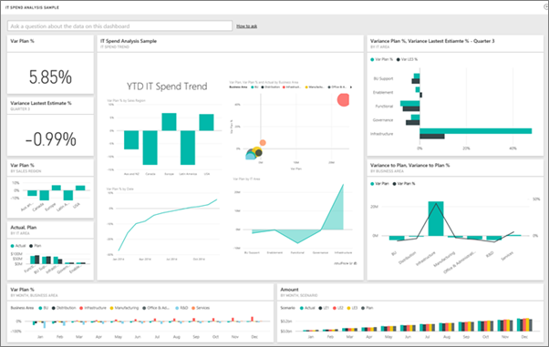

<properties 
   pageTitle="Dashboards for mobile Power BI"
   description="Dashboards for mobile Power BI"
   services="powerbi" 
   documentationCenter="" 
   authors="maggiesMSFT" 
   manager="mblythe" 
   editor=""
   tags=""
   qualityFocus="no"
   qualityDate=""/>
 
<tags
   ms.service="powerbi"
   ms.devlang="NA"
   ms.topic="article"
   ms.tgt_pltfrm="NA"
   ms.workload="powerbi"
   ms.date="03/11/2016"
   ms.author="maggies"/>
# Dashboards for mobile Power BI

Dashboards are a portal to your company's life cycle and processes. A dashboard is an overview, a single place to monitor the current state of the business. In Power BI, you can bring together data from different data sources in a single dashboard &#151; for example, Excel workbooks, databases, content packs with your origanizion's data, and services such as Salesforce.

## Create dashboards in the Power BI service
You don't create dashboards in the mobile apps. To have more dashboards on your mobile device, you create or connect to them on your computer. 

1. Go to the Power BI service ([https://www.powerbi.com](https://www.powerbi.com)) and [sign up for an account](powerbi-service-self-service-signup-for-power-bi.md).

2. [Create your own Power BI dashboards](powerbi-service-create-a-dashboard.md), or connect to existing [content packs for a variety of services](powerbi-content-packs-services.md).

*A Power BI dashboard in the Power BI service*

## View dashboards in the Power BI mobile apps

Then in the Power BI mobile apps, explore these same dashboards. Dashboards refresh in real time, automatically, so no need to manually refresh them.

*The same dashboard in a mobile phone*

[Dashboards in the iPad app for Power BI for iOS](powerbi-mobile-dashboards-on-the-ipad-app.md)

[Dashboards in the iPhone app for Power BI for iOS](powerbi-mobile-dashboards-in-the-iphone-app.md)

[Dashboards in the Power BI mobile app for Windows 10 devices](powerbi-mobile-dashboards-in-the-win10phone-app.md)

[Dashboards in the Power BI app for Android phones](powerbi-mobile-dashboards-in-the-android-app.md)