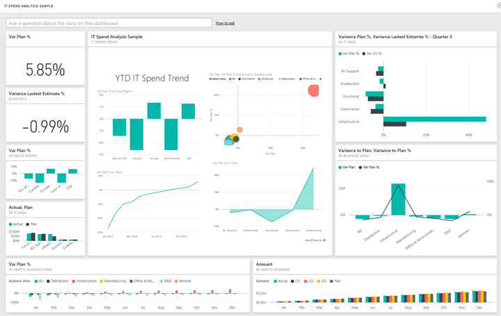
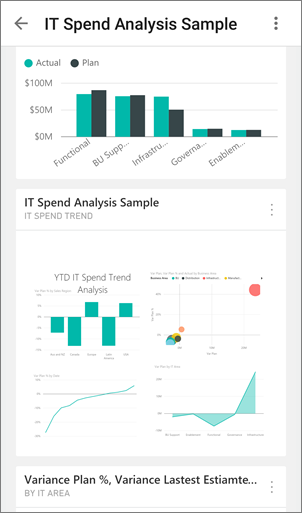

<properties 
   pageTitle="Dashboards for mobile Power BI"
   description="Dashboards for mobile Power BI"
   services="powerbi" 
   documentationCenter="" 
   authors="maggiesMSFT" 
   manager="mblythe" 
   editor=""
   tags=""/>
 
<tags
   ms.service="powerbi"
   ms.devlang="NA"
   ms.topic="article"
   ms.tgt_pltfrm="NA"
   ms.workload="powerbi"
   ms.date="02/03/2016"
   ms.author="maggies"/>
# Dashboards for mobile Power BI

Dashboards are a portal to your company's life cycle and processes. A dashboard is an overview, a single place to monitor the current state of the business. 

Power BI brings together data from different data sources &#151; for example, services such as Salesforce, organizational content packs, databases, and Excel workbooks.

To get more dashboards on your mobile device, start from your computer. Open a web browser, sign up for Power BI at [https://www.powerbi.com](https://www.powerbi.com), and follow the instructions for [creating a Power BI dashboard](powerbi-service-create-a-dashboard.md) or connecting to [content packs for a variety of services](powerbi-content-packs-services.md).

## View dashboards in the Power BI mobile apps

Then in the Power BI mobile apps, explore these same dashboards. Dashboards refresh in real time, automatically, so no need to manually refresh them.

[Dashboards in the iPad app for Power BI for iOS](powerbi-mobile-dashboards-on-the-ipad-app.md)

[Dashboards in the iPhone app for Power BI for iOS](powerbi-mobile-dashboards-in-the-iphone-app.md)

[Dashboards in the Power BI mobile app for Windows 10 devices](powerbi-mobile-dashboards-in-the-win10phone-app.md)

[Dashboards in the Power BI app for Android phones](powerbi-mobile-dashboards-in-the-android-app.md)