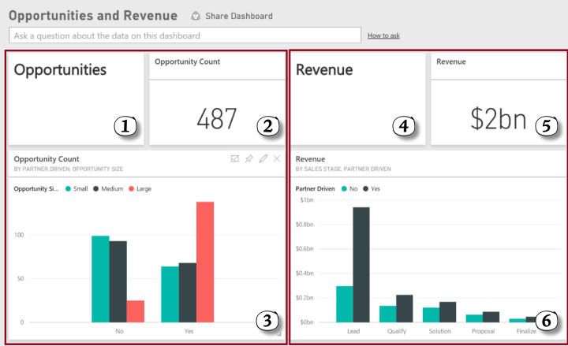
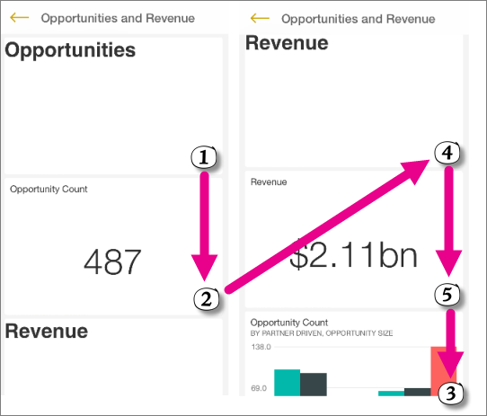
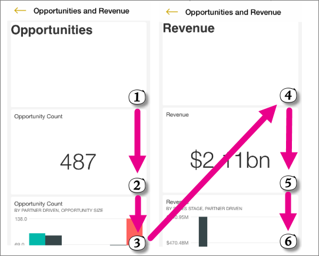
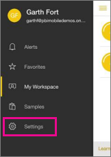
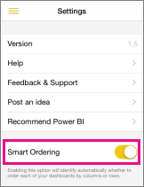

<properties 
   pageTitle="Turn on smart ordering for dashboards in the iPhone app"
   description="Turn on smart ordering for dashboards in the iPhone app (Power BI for iOS)"
   services="powerbi" 
   documentationCenter="" 
   authors="maggiesMSFT" 
   manager="mblythe" 
   editor=""
   tags=""/>
 
<tags
   ms.service="powerbi"
   ms.devlang="NA"
   ms.topic="article"
   ms.tgt_pltfrm="NA"
   ms.workload="powerbi"
   ms.date="11/19/2015"
   ms.author="maggies"/>

# Turn on smart ordering for dashboards in the iPhone app (Power BI for iOS)  

Dashboards are a portal to your company's life cycle and processes. A dashboard is an overview, a single place to monitor the current state of the business. 

In the Power BI iPhone app, you can view your dashboards in two formats:  

- When your phone is in portrait mode, you see a series of tiles one after another, to maximize tile size.
- When you turn your phone sideways to landscape mode, you see the tiles arranged in the same dashboard format you see in the Power BI service on the web.

When your phone is in portrait mode, by default Power BI displays the series of tiles one after the other in left-to-right, then top-to-bottom order, regardless of the initial intention of the dashboard creator. 

Maybe the dashboard creator wanted the dashboard to be viewed column by column -- that is, top to bottom, then left to right. With “smart ordering”, the Power BI app on your iPhone can figure that out.  

When you turn on smart ordering, the Power BI app evaluates each dashboard and decides if it’s row-based or column-based, based on the order and structure of tiles on the dashboard. Then the Power BI app orders the dashboard accordingly, for the most logical experience. 

For example, in the Power BI service on the web, this column-based dashboard has two columns: **Opportunities** and **Revenue**: 

With smart ordering off, on the iPhone the tiles are in 1 - 2 - 4 - 5 - 3 order:

With smart ordering turned on, the tiles are in 1 - 2 - 3 - 4 - 5 - 6 order:

You don’t have to remember to turn on smart ordering every time. Next time you open a column-based dashboard on your iPhone, Power BI suggests that for you. You just tap **Yes**. 

## Turn on smart ordering on your iPhone  
1.  Open the Power BI app on your iPhone and sign in.

    Need to [download the iPad app](http://go.microsoft.com/fwlink/?LinkId=522062) from the Apple App Store?

2.  From the navigation pane, tap **Settings**.

    

3.  Turn on **Smart Ordering**.  

     

6.  Tap the menu in the upper-left corner to go back.

### See also  
[Get started with the iPhone app for Power BI](powerbi-mobile-ipad-app-get-started.md)  
[Get started with Power BI](powerbi-service-get-started.md)  