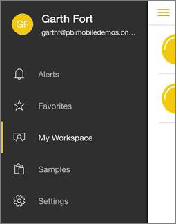

<properties 
   pageTitle="Dashboards in the Android app for Power BI"
   description="Dashboards in the Android app for Power BI"
   services="powerbi" 
   documentationCenter="" 
   authors="maggiesMSFT" 
   manager="mblythe" 
   editor=""
   tags=""/>
 
<tags
   ms.service="powerbi"
   ms.devlang="NA"
   ms.topic="article"
   ms.tgt_pltfrm="NA"
   ms.workload="powerbi"
   ms.date="11/24/2015"
   ms.author="maggies"/>

# Dashboards in the Android app for Power BI  

Dashboards are a portal to your company's life cycle and processes. A dashboard is an overview, a single place to monitor the current state of the business. 

Power BI brings together data from different types of data sources &#151; for example, SaaS such as Salesforce, organizational content packs, databases, and Excel workbooks.

You [create and connect to dashboards in the Power BI service](powerbi-service-dashboards.md). Then in the [Android app for Microsoft Power BI](powerbi-mobile-android-app-get-started.md), you can explore these same dashboards.

## View dashboards on your Android phone  
1.  Open the Power BI app on your Android phone and sign in.

    Need to [download the Android app](http://go.microsoft.com/fwlink/?LinkID=544867) first?

2.  From the home page, swipe right to see your dashboards. 
  
    

3.  Tap a dashboard to open it.   

    

    Power BI dashboards look a little different on your Android phone. All the tiles appear the same width, and they're arranged one after another from top to bottom.

    

5.  While on the dashboard, you can:

    -   Tap the Invite icon  in the upper-right corner to [share your dashboard](powerbi-mobile-share-a-dashboard-from-the-android-app.md) with a colleague.

    -   Tap the Star icon  to mark some of the [dashboard tiles as favorites](powerbi-mobile-favorites-in-the-android-app.md).

    -   Tap the i icon  for information about the dashboard.

6.  Swipe to see all the [tiles in the dashboard](powerbi-mobile-tiles-in-the-android-app.md). Tap the vertical ellipsis on the tile.

    

    From here, you can: 
    - Make the tile a [favorite](powerbi-mobile-favorites-in-the-android-app.md).
    - [Annotate and share the tile](powerbi-mobile-annotate-and-share-a-tile-from-the-android-app.md).
    - Open it in focus mode.
    - [Open the link](powerbi-service-edit-a-tile-in-a-dashboard.md#hyperlink) inside the Power BI app, if it has a link. Links can go to Power BI dashboards, or to an external URL. If it's an external site, Power BI asks you to allow it.
    
        

        After you open the link in the Power BI app, you can copy the link or open it in a browser window instead.

7.  To go back to the dashboards home page, tap the back arrow  in the upper bar.

### See also  
[Download the Android app](http://go.microsoft.com/fwlink/?LinkID=544867) from Google play  
[Get started with the Android app for Power BI](powerbi-mobile-android-app-get-started.md)  
[Get started with Power BI](powerbi-service-get-started.md)  