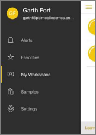

<properties 
   pageTitle="Dashboards in the iPhone app (Power BI for iOS)"
   description="Dashboards in the iPhone app (Power BI for iOS)"
   services="powerbi" 
   documentationCenter="" 
   authors="maggiesMSFT" 
   manager="mblythe" 
   editor=""
   tags=""/>
 
<tags
   ms.service="powerbi"
   ms.devlang="NA"
   ms.topic="article"
   ms.tgt_pltfrm="NA"
   ms.workload="powerbi"
   ms.date="11/13/2015"
   ms.author="maggies"/>

# Dashboards in the iPhone app (Power BI for iOS)  

Dashboards are a portal to your company's life cycle and processes. A dashboard is an overview, a single place to monitor the current state of the business. 

Power BI comes with built-in dashboards for some data sources such as Salesforce, and you can create your own [dashboards in Power BI](powerbi-service-dashboards.md). Your colleagues can also share their dashboards with you.

In the iPhone app for Microsoft Power BI for iOS, you see and can interact with all of these dashboards.

## View dashboards on your iPhone  
1.  Open the Power BI app on your iPhone and sign in.

    Need to [download the iPad app](http://go.microsoft.com/fwlink/?LinkId=522062) from the Apple App Store?

2.  From the navigation pane, swipe right to see your dashboards.

     

3.  Tap a dashboard to open it.  

    Power BI dashboards look a little different on your iPhone. All the tiles appear the same size, and they're arranged one after another from top to bottom.

    You can also view dashboards horizontally, just by turning your phone. Read more about [landscape mode in the iPhone app](http://blogs.msdn.com/b/powerbi/archive/2015/11/02/enjoy-the-landscape-with-the-power-bi-iphone-app.aspx).

    

5.  Swipe up and down to see all the tiles in the dashboard.

    While here, you can:

    -   [Tap a tile](powerbi-mobile-tiles-in-the-iphone-app.md) to open and interact with it.

    -   Tap the Share icon  in the upper-right corner to [invite a colleague](powerbi-mobile-share-a-dashboard-from-the-iphone-app.md) to view your dashboard.
    -   Tap the star  to mark dashboard tiles as [favorites](powerbi-mobile-favorites-in-the-iphone-app.md).  

6.  Tap the back arrow in the upper-left corner or tap **Dashboards** in the bottom bar.

## See also  
[Get started with the iPhone app for Power BI](powerbi-mobile-ipad-app-get-started.md)  
[Get started with Power BI](powerbi-service-get-started.md)  