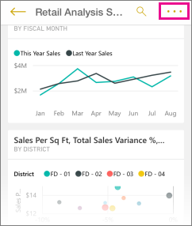

<properties 
   pageTitle="Dashboards in the iPhone app"
   description="Dashboards are a portal to your company's life cycle. Learn how you can view, explore, and share your dashboards in the Power BI for iOS  app on the iPhone." 
   documentationCenter="" 
   authors="maggiesMSFT" 
   manager="mblythe" 
   backup=""
   editor=""
   tags=""
   qualityFocus="monitoring"
   qualityDate="03/11/2016"/>
 
<tags
   ms.service="powerbi"
   ms.devlang="NA"
   ms.topic="article"
   ms.tgt_pltfrm="NA"
   ms.workload="powerbi"
   ms.date="06/23/2016"
   ms.author="maggies"/>

# Dashboards in the iPhone app (Power BI for iOS)  

Dashboards are a portal to your company's life cycle. Learn how you can view, explore, and share your dashboards in the Power BI for iOS  app on the iPhone.  

You don't create dashboards in the Power BI app on your iPhone. You [create dashboards](powerbi-service-dashboards.md) or [connect to built-in dashboards for services](powerbi-content-packs-services.md) such as Salesforce in the Power BI service ([https://www.powerbi.com](https://www.powerbi.com)) on your computer.

Then in the iPhone app for Microsoft Power BI for iOS, you can explore these same dashboards. Dashboards refresh in real time, automatically, so you don't need to manually refresh them.

## View dashboards on your iPhone  
1.  Open the Power BI app on your iPhone and sign in.

    Need to [download the iPad app](http://go.microsoft.com/fwlink/?LinkId=522062) from the Apple App Store?

     

3.  Tap a dashboard to open it.  

    Power BI dashboards look a little different on your iPhone. All the tiles appear the same size, and they're arranged one after another from top to bottom.

     Or just turn your phone sideways to [view them in landscape mode](#view-dashboards-in-landscape-mode) on your phone.

4.  Swipe up and down to see all the tiles in the dashboard.

    While here, you can:

    -   [Tap a tile](powerbi-mobile-tiles-in-the-iphone-app.md) to open and interact with it.

    -   [Interact with a report page tile](powerbi-mobile-report-page-tiles-in-the-iphone-app.md) in the iPhone app.

    -   Tap the ellipsis to open the dashboard menu, and then...

        

    -  Tap **Invite** to [invite a colleague](powerbi-mobile-share-a-dashboard-from-the-iphone-app.md) to view your dashboard.

    -  [Add a picture tile](powerbi-mobile-picture-tiles-in-the-iphone-app.md) to your dashboard

    -  [Sync the dashboard with your Apple Watch](powerbi-mobile-apple-watch.md).

6.  Tap the back arrow in the upper-left corner to get back to the list of dashboards.

## View dashboards in landscape mode
You can also view dashboards in landscape mode, just by turning your phone. The dashboard layout changes from a series of tiles to a view of the whole dashboard &#151; you see all of the dashboard’s tiles as they are in the Power BI service.

You can use the “pinch” gesture to zoom in and out on different areas of your dashboard, pan to navigate it. And you can still [tap a tile](powerbi-mobile-tiles-in-the-win10phone-app.md) to open the tile in focus mode and interact with your data.

### See also  
[Get started with the iPhone app for Power BI](powerbi-mobile-iphone-app-get-started.md)  
[Get started with Power BI](powerbi-service-get-started.md)  