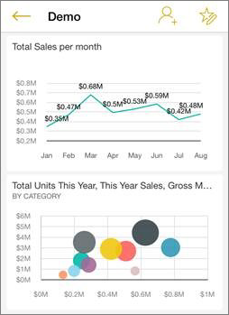

<properties 
   pageTitle="Dashboards in the Windows 10 phone app for Power BI"
   description="Dashboards in the Windows 10 phone app for Power BI"
   services="powerbi" 
   documentationCenter="" 
   authors="maggiesMSFT" 
   manager="mblythe" 
   editor=""
   tags=""/>
 
<tags
   ms.service="powerbi"
   ms.devlang="NA"
   ms.topic="article"
   ms.tgt_pltfrm="NA"
   ms.workload="powerbi"
   ms.date="12/01/2015"
   ms.author="maggies"/>

# Dashboards in the Windows 10 phone app for Power BI  

Dashboards are a portal to your company's life cycle and processes. A dashboard is an overview, a single place to monitor the current state of the business. 

Power BI brings together data from different types of data sources &#151; for example, services such as Salesforce, content packs from your organization, databases, and Excel workbooks.

You [create and connect to dashboards in the Power BI service](powerbi-service-dashboards.md). Then in the [Windows 10 phone app for Microsoft Power BI](powerbi-mobile-win10phone-app-get-started.md), you can explore these same dashboards.

## View dashboards on your Windows 10 phone  
1.  Open the Power BI app on your Windows 10 phone and sign in.

    Need to [download the Windows 10 phone app](http://go.microsoft.com/fwlink/?LinkID=544867) first?

2.  From the home page, swipe right to see your dashboards. 
  
    <!---->

3.  Tap a dashboard to open it.   

    <!---->

    Power BI dashboards look a little different on your Windows 10 phone. All the tiles appear the same width, and they're arranged one after another from top to bottom.

    <!---->

    >**Tip:**  You can also tap the ellipsis (**...**) to invite a colleague or see information about the dashboard.

    <!---->

5.  Swipe to see all the tiles in the dashboard. While here, you can:

    -   [Tap a tile](powerbi-mobile-dashboards-in-the-win10phone-app.md) to open and interact with it.

    -   Tap the **Invite** icon <!----> in the upper-right corner to [share your dashboard](powerbi-mobile-share-a-dashboard-from-the-win10phone-app.md) with a colleague.

    -   Tap the **i** icon <!----> for information about the dashboard.

6.  To go back to the dashboards home page, tap the back arrow <!----> in the upper bar.

### See also  
[Download the Windows 10 phone app](http://go.microsoft.com/fwlink/?LinkID=544867) from the Windows Store  
[Get started with the Windows 10 phone app for Power BI](powerbi-mobile-win10phone-app-get-started.md)  
[Get started with Power BI](powerbi-service-get-started.md)  