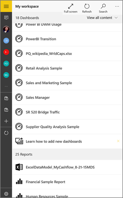
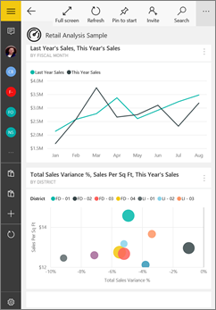

<properties 
   pageTitle="Dashboards in the Power BI mobile app for Windows 10"
   description="Dashboards in the Power BI mobile app for Windows 10"
   services="powerbi" 
   documentationCenter="" 
   authors="maggiesMSFT" 
   manager="mblythe" 
   backup=""
   editor=""
   tags=""
   qualityFocus="monitoring"
   qualityDate="03/11/2016"/>
 
<tags
   ms.service="powerbi"
   ms.devlang="NA"
   ms.topic="article"
   ms.tgt_pltfrm="NA"
   ms.workload="powerbi"
   ms.date="06/22/2016"
   ms.author="maggies"/>

# Dashboards in the Power BI mobile app for Windows 10  

Dashboards are a portal to your company's life cycle and processes. A dashboard is an overview, a single place to monitor the current state of the business. 

You don't create dashboards in Power BI on your Windows 10 mobile device. You [create dashboards](powerbi-service-dashboards.md) or [connect to built-in dashboards for services](powerbi-content-packs-services.md) such as Salesforce in the Power BI service ([https://www.powerbi.com](https://www.powerbi.com)) on your computer.

Then in the [Power BI mobile app for Windows 10](powerbi-mobile-win10phone-app-get-started.md), you can explore these same dashboards.

## View dashboards on your Windows 10 device  
1.  Open the Power BI app on your Windows 10 device and sign in.

    Need to [download the app](http://go.microsoft.com/fwlink/?LinkID=526478) first?

2.  Tap a dashboard to open it.   

    

    Power BI dashboards look a little different on your Windows 10 phone. All the tiles appear the same width, and they're arranged one after another from top to bottom.

    

     You can just turn your phone sideways to [view dashboards in landscape mode](#view-dashboards-in-landscape-mode) on your phone.

5.  In the dashboard, you can:

    -   Tap the **Full Screen** icon  to present your Power BI dashboard without borders or menus, like **Slide Show** view in PowerPoint.
    -   Tap the **Invite** icon  to [share your dashboard](powerbi-mobile-share-a-dashboard-from-the-win10phone-app.md) with a colleague.
    -   Tap the ellipsis (...) > **Pin to Start** to [pin the dashboard to your Windows Start screen](powerbi-mobile-pin-dashboard-from-win10phone-app.md). 

    -   [Tap a tile](powerbi-mobile-tiles-in-the-win10phone-app.md) to open and interact with it.
    

6.  To go back to the dashboards home page, tap the back arrow or back button.

## View dashboards in landscape mode
You can also view dashboards in landscape mode, just by turning your phone. The dashboard layout changes from a series of tiles to a view of the whole dashboard &#151; you see all of the dashboard’s tiles laid out as they are in the Power BI service.

You can use the “pinch” gesture to zoom in and out on different areas of your dashboard, pan to navigate it. And you can still [tap a tile](powerbi-mobile-tiles-in-the-win10phone-app.md) to open the tile in focus mode and interact with your data.

### See also  
[Download the Power BI mobile app for Windows 10](http://go.microsoft.com/fwlink/?LinkID=526478) from the Windows Store  
[Get started with the Power BI mobile app for Windows 10](powerbi-mobile-win10phone-app-get-started.md)  
[Get started with Power BI](powerbi-service-get-started.md)  
