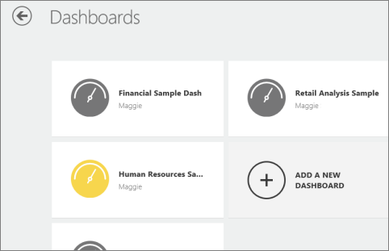
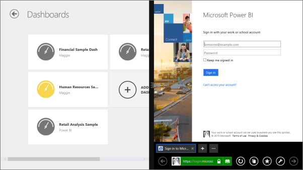

<properties pageTitle="Dashboards in the Power BI for Windows app" description="Dashboards in the Power BI for Windows app" services="powerbi" documentationCenter="" authors="v-anpasi" manager="mblythe" editor=""/>
<tags ms.service="powerbi" ms.devlang="NA" ms.topic="article" ms.tgt_pltfrm="NA" ms.workload="powerbi" ms.date="06/26/2015" ms.author="v-anpasi"/>
#Dashboards in the Power BI for Windows app

[← Power BI app for Windows](https://support.powerbi.com/knowledgebase/topics/75729-power-bi-app-for-windows)

Dashboards are a portal to your company's life cycle and processes. A dashboard is an overview, a single place to monitor the current state of the business.

Microsoft Power BI comes with built-in dashboards for some data sources such as Salesforce, and you create your own [dashboards in Power BI](http://support.powerbi.com/knowledgebase/articles/424868-dashboards-in-power-bi).

Then you see those same dashboards in the Power BI for Windows app, and you can see dashboards your colleagues share with you.

## View dashboards in your Power BI for Windows app

1.  From the Windows start screen open the Power BI for Windows app.

    
    
    On the app home page, you see the first of your dashboards.
    
2.  If you have a lot of them, tap **Dashboards** to see them all.
3.  Swipe from side to side to see all of your dashboards.
    
4.  Or you can create a dashboard: Tap **Add a New Dashboard.**  

    
    
    A browser opens. Here you can sign in to your Power BI account and create or modify your dashboards and reports.

    
    

More about the [Power BI for Windows app](http://support.powerbi.com/knowledgebase/articles/510917-get-started-with-the-power-bi-for-windows-app).