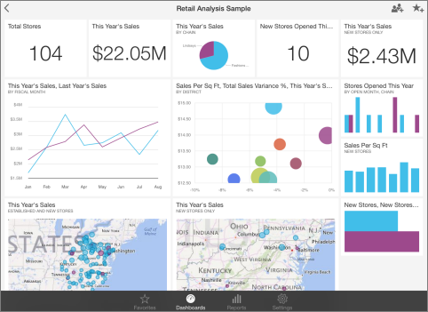
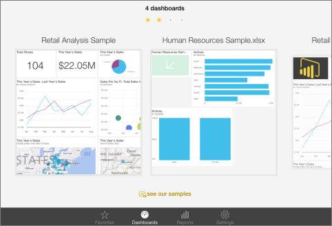

<properties pageTitle="Dashboards on the iPad app (Power BI for iOS)" description="Dashboards on the iPad app (Power BI for iOS)" services="powerbi" documentationCenter="" authors="v-anpasi" manager="mblythe" editor=""/>
<tags ms.service="powerbi" ms.devlang="NA" ms.topic="article" ms.tgt_pltfrm="NA" ms.workload="powerbi" ms.date="06/26/2015" ms.author="v-anpasi"/>
#Dashboards on the iPad app (Power BI for iOS)

[← iPad app (Power BI for iOS)](https://support.powerbi.com/knowledgebase/topics/77999-ipad-app-power-bi-for-ios-preview)

Dashboards are a portal to your company's life cycle and processes. A dashboard is an overview, a single place to monitor the current state of the business.

Power BI comes with built-in dashboards for some data sources such as Salesforce, and you [create your own dashboards in Power BI](http://support.powerbi.com/knowledgebase/articles/424868-dashboards-in-power-bi).

Then you see these same dashboards in the iPad app for Microsoft Power BI for iOS, and you can see dashboards your colleagues share with you.

##View dashboards on your iPad

1.  Open the Power BI app.  
    Need to [download the iPad app](http://go.microsoft.com/fwlink/?LinkId=522062) from the Apple App Store first?
2.  Tap **Dashboards  **in the bottom bar.
3.  Swipe from side to side to see your available Power BI dashboards.

    

4.  Tap a dashboard to open it. Now you see the tiles in that dashboard. You can:  
    [Make favorites](https://support.powerbi.com/knowledgebase/articles/467179) of the tiles.  
    [Open the reports](https://support.powerbi.com/knowledgebase/articles/467180) behind the tiles.  
    [Share the dashboard](https://support.powerbi.com/knowledgebase/articles/467181).  
    [Annotate and share a snapshot](https://support.powerbi.com/knowledgebase/articles/527030) of a tile.
5.  Click the back arrow in the upper-left corner or tap **Dashboards** in the bottom bar.

More about [the iPad app](http://support.powerbi.com/knowledgebase/articles/467172-the-ipad-app-for-power-bi-preview) for Power BI.

This is a draft topic in development. Feedback? Click **Contact support** on the right side of this page.