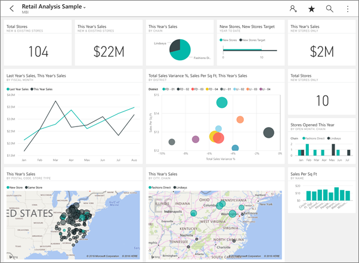

<properties 
   pageTitle="Dashboards on the iPad app"
   description="Dashboards are a portal to your company's life cycle. Learn how you can view, explore, and share your dashboards in the Power BI app for iOS on your iPad."
   services="powerbi" 
   documentationCenter="" 
   authors="maggiesMSFT" 
   manager="mblythe" 
   backup=""
   editor=""
   tags=""
   qualityFocus="monitoring"
   qualityDate="03/11/2016"/>
 
<tags
   ms.service="powerbi"
   ms.devlang="NA"
   ms.topic="article"
   ms.tgt_pltfrm="NA"
   ms.workload="powerbi"
   ms.date="10/10/2016"
   ms.author="maggies"/>
# Dashboards on the iPad app (Power BI for iOS)

Dashboards are a portal to your company's life cycle. Learn how you can view, explore, and share your dashboards in the Power BI app for iOS on your iPad.

You don't create dashboards on your iPad. In the Power BI service ([https://www.powerbi.com](https://www.powerbi.com)) on your computer, you [create dashboards](powerbi-service-dashboards.md) or [connect to built-in dashboards for services](powerbi-content-packs-services.md) such as Salesforce.

Then you see these same dashboards in the iPad app for Microsoft Power BI for iOS, along with dashboards your colleagues share with you.

## View dashboards on your iPad

1.  Open the Power BI app.

    Need to [download the iPad app](http://go.microsoft.com/fwlink/?LinkId=522062) from the Apple App Store first?

2.  Tap **Dashboards** at the top of the app.  

    

    The dashboards with the yellow stars are favorites, and the notation below each dashboard name shows how the data in each dashboard is classified. 

3.  You can share a dashboard from your workspace. Tap the ellipsis (...) in the lower-right corner of the dashboard tile, and tap **Invite Others**.

    

4.  You can also tap a dashboard to open it and see the tiles in that dashboard.

4.  While on the dashboard you can:

    - [Tap a tile to interact](powerbi-mobile-tiles-in-the-ipad-app.md) with it.

    - [Open the reports](powerbi-mobile-reports-on-the-ipad-app.md) behind the tiles.

    - [Share the dashboard](powerbi-mobile-share-dashboards-from-the-ipad-app.md).

    - [Annotate and share a snapshot](powerbi-mobile-annotate-and-share-a-snapshot-from-the-ipad-app.md) of a tile.

4.  Tap the name of the dashboard in the upper-left corner, then tap **My Workspace**.

    

### See also

-   [Get started with the iPad app](powerbi-mobile-iphone-app-get-started.md) for Power BI.
- Questions? [Try asking the Power BI Community](http://community.powerbi.com/)

