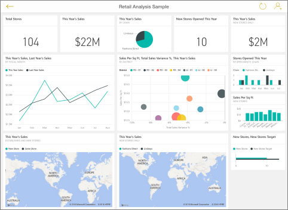
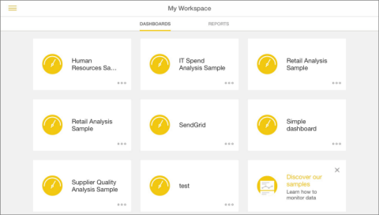

<properties 
   pageTitle="Dashboards on the iPad app"
   description="Dashboards on the iPad app (Power BI for iOS)"
   services="powerbi" 
   documentationCenter="" 
   authors="maggiesMSFT" 
   manager="mblythe" 
   editor=""
   tags=""/>
 
<tags
   ms.service="powerbi"
   ms.devlang="NA"
   ms.topic="article"
   ms.tgt_pltfrm="NA"
   ms.workload="powerbi"
   ms.date="02/01/2016"
   ms.author="maggies"/>
# Dashboards on the iPad app (Power BI for iOS)

Dashboards are a portal to your company's life cycle and processes. A dashboard is an overview, a single place to monitor the current state of the business.

Power BI comes with built-in dashboards for some data sources such as Salesforce, and you [create your own dashboards in Power BI](powerbi-service-dashboards.md).

Then you see these same dashboards in the iPad app for Microsoft Power BI for iOS, and you can see dashboards your colleagues share with you.

## View dashboards on your iPad

1.  Open the Power BI app.

    Need to [download the iPad app](http://go.microsoft.com/fwlink/?LinkId=522062) from the Apple App Store first?

2.  Tap **Dashboards **at the top of the app and tap a dashboard to open it. 

    

3.  You see the tiles in that dashboard. Now you can:

    [Interact with the tiles](powerbi-mobile-tiles-in-the-ipad-app.md).

    [Open the reports](powerbi-mobile-reports-on-the-ipad-app.md) behind the tiles.

    [Share the dashboard](powerbi-mobile-share-dashboards-from-the-ipad-app.md).

    [Annotate and share a snapshot](powerbi-mobile-annotate-and-share-a-snapshot-from-the-ipad-app.md) of a tile.

4.  Click the back arrow in the upper-left corner or tap **Dashboards** in the bottom bar.

More about [the iPad app](powerbi-mobile-iphone-app-get-started.md) for Power BI.

