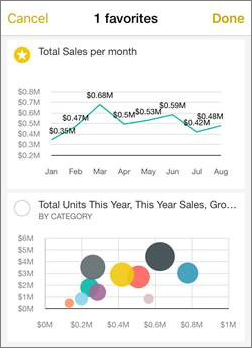
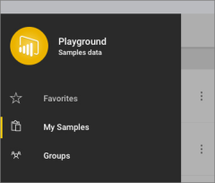
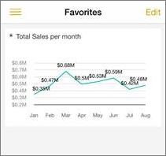

<properties 
   pageTitle="Favorites in the Android app for Power BI"
   description="Favorites in the Android app for Power BI"
   services="powerbi" 
   documentationCenter="" 
   authors="maggiesMSFT" 
   manager="mblythe" 
   editor=""
   tags=""/>
 
<tags
   ms.service="powerbi"
   ms.devlang="NA"
   ms.topic="article"
   ms.tgt_pltfrm="NA"
   ms.workload="powerbi"
   ms.date="11/24/2015"
   ms.author="maggies"/>
# Favorites in the Android app for Power BI

For easy access to your most interesting data, you can mark specific tiles as favorites in the [Android app for Microsoft Power BI](powerbi-mobile-android-app-get-started.md). Only you can see your Favorites page, where you bring together in one place your favorite tiles from all of your dashboards.

>**Note:**  You can't see your Android favorites in the browser or on other mobile devices.

## Create favorites

1.  Open a [dashboard in the Android app](powerbi-mobile-dashboards-in-the-android-app.md) for Power BI.

    Need to [download the Android app](http://go.microsoft.com/fwlink/?LinkID=544867) first?

2.  In the dashboard, tap the star with the pencil icon  in the upper bar, and tap the tiles you want on your Favorites page.

    Or: When a [tile is in focus mode](powerbi-mobile-tiles-in-the-android-app.md), tap the star icon .

3.  Favorite tiles now have a star in their upper-left corner.

    

4.  When you've selected all the favorites you want, tap **Done** in the upper-right corner, or tap the back arrow in the upper-left corner to cancel.

## View your favorites

-   On the Power BI home, tap **Favorites**. 
      
    

    Your favorites from all your dashboards are on this one page.

    

## Remove favorites

Removing a favorite doesn't remove the tile from the dashboard. It's just no longer on your Favorites page.

1.  On the Favorites page, tap **Edit** in the upper-right corner and clear the stars from the tiles you don't want as favorites.

    **Tip** You can also remove a favorite when you're on a dashboard by tapping the dashboard star icon and clearing the star on the tile, or  when you're  looking at a [tile in focus mode](powerbi-mobile-annotate-and-share-a-tile-from-the-android-app.md) by tapping the star again.

2.  When you've finished, tap **Done** in the upper-right corner, or tap **Cancel**.

### See also

[Download the Android app](http://go.microsoft.com/fwlink/?LinkID=544867) from Google play

[Get started with the Android app for Power BI](powerbi-mobile-android-app-get-started.md)

[Get started with Power BI](powerbi-service-get-started.md)

