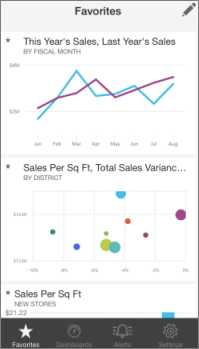

<properties 
   pageTitle="Favorites in the iPhone app (Power BI for iOS)"
   description="Favorites in the iPhone app (Power BI for iOS)"
   services="powerbi" 
   documentationCenter="" 
   authors="maggiesMSFT" 
   manager="mblythe" 
   editor=""
   tags=""/>
 
<tags
   ms.service="powerbi"
   ms.devlang="NA"
   ms.topic="article"
   ms.tgt_pltfrm="NA"
   ms.workload="powerbi"
   ms.date="10/14/2015"
   ms.author="maggies"/>
# Favorites in the iPhone app (Power BI for iOS)

For easy access to your most interesting data, you can mark specific tiles as favorites in the [iPhone app for Microsoft Power BI](http://support.powerbi.com/knowledgebase/topics/78002-iphone-app-power-bi-for-ios-preview) for iOS. Only you can see your Favorites dashboard, which brings your favorite tiles from all of your dashboards together in one place.

>**Note**   You can't see your iPhone favorites on your iPad, or vice versa.

## Create favorites

1.  In your dashboard in the iPhone app, tap the Options icon \> tap **Add to favorites**.

    

2.  Tap the circles in the upper-right corner of the tiles you want on your Favorites page.

    Each favorite tile now has a star in its upper-left corner.

    

3.  Tap the check mark in the upper-right corner when you've selected all the favorites you want.

## View your favorites

-   Tap **Favorites**  in the bar at the bottom of the app.

    Your favorites from all your dashboards are on this one page.

    

## Remove favorites

1.  On the Favorites page, tap the pencil in the upper-right corner  and clear the stars from the tiles you don't want as favorites.

    >**Note**   Removing a favorite doesn't remove the tile from the dashboard, or the chart from the report. It's just no longer a favorite.

2.  Tap the check mark in the upper-right corner when you've finished.

### See Also

[Get started with the iPhone app for Power BI](powerbi-mobile-ipad-app-get-started.md)

[Get started with Power BI](powerbi-service-get-started.md)

