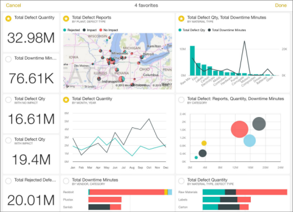
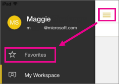
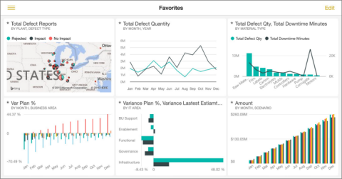
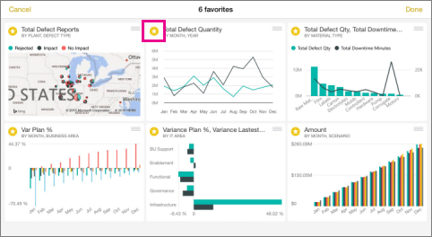

<properties 
   pageTitle="Favorites on the iPad app (Power BI for iOS)"
   description="Favorites on the iPad app (Power BI for iOS)"
   services="powerbi" 
   documentationCenter="" 
   authors="v-aljenk" 
   manager="mblythe" 
   editor=""
   tags=""/>
 
<tags
   ms.service="powerbi"
   ms.devlang="NA"
   ms.topic="article"
   ms.tgt_pltfrm="NA"
   ms.workload="powerbi"
   ms.date="10/14/2015"
   ms.author="v-aljenk"/>

# Favorites on the iPad app (Power BI for iOS)

For fast and easy access to your most interesting data, you can mark specific tiles as favorites in the [iPad app for Microsoft Power BI](http://support.powerbi.com/knowledgebase/topics/69272-ipad-app-for-power-bi) for iOS. Only you can see your Favorites dashboard, which brings together in one place your favorite tiles from all of your dashboards.

**Note** You can't see your iPad favorites on your iPhone, and vice versa.

## Create favorites

1.  In a dashboard in the iPad app, tap the Add Favorites icon .

2.  Tap the tiles you want on your Favorites page.

3.  Each favorite tile now has a star in its upper-left corner.

    

4.  Tap **Done** in the upper-right corner when you've selected them all.
 
## View your favorites

-   On the dashboard or report home page of the app, tap the Options icon  in the upper-left corner, and tap **Favorites**.

    

    Your favorites from all your dashboards are on this one page.

    

## Remove favorites

1.  On the Favorites page, tap **Edit** in the upper-right corner and clear the stars from the tiles you don't want as favorites.

    

    **NOTE**: This doesn't remove the tile from the dashboard, or the chart from the report. It's just no longer a favorite.

2.  Tap **Done** in the upper-right corner when you've finished.

More about [the iPad app](http://support.powerbi.com/knowledgebase/articles/467172) for Power BI.
