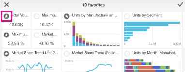
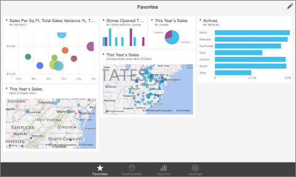
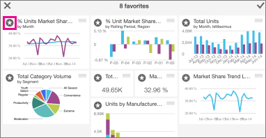

<properties pageTitle="Favorites on the iPad app (Power BI for iOS)" description="Favorites on the iPad app (Power BI for iOS)" services="powerbi" documentationCenter="" authors="v-anpasi" manager="mblythe" editor=""/>
<tags ms.service="powerbi" ms.devlang="NA" ms.topic="article" ms.tgt_pltfrm="NA" ms.workload="powerbi" ms.date="06/26/2015" ms.author="v-anpasi"/>
# Favorites on the iPad app (Power BI for iOS)
[← iPad app (Power BI for iOS)](https://support.powerbi.com/knowledgebase/topics/77999-ipad-app-power-bi-for-ios-preview)

For fast and easy access to your most interesting data, you can mark specific tiles as favorites in the [iPad app for Microsoft Power BI](http://support.powerbi.com/knowledgebase/topics/69272-ipad-app-for-power-bi) for iOS. Only you can see your Favorites dashboard, which brings together in one place your favorite tiles from all of your dashboards.

**Note**   You can't see your iPad favorites on your iPhone, and vice versa.

## Create favorites
1.  In your dashboard on the iPad app, tap Favorites .
2.  Tap the tiles you want on your Favorites page.  
    Each favorite tile now has a star in its upper-left corner.

    
    
3.  Tap the check mark in the upper-right corner when you've selected them all.

## View your favorites
-   Tap **Favorites** ** **in the bar at the bottom of the app.  
    Your favorites from all your dashboards are on this one page.

    
    

## Remove favorites
1.  On the Favorites page, tap the pencil in the upper-right corner  and clear the stars from the tiles you don't want as favorites.

    
    
    NOTE: This doesn't remove the tile from the dashboard, or the chart from the report. It's just no longer a favorite.
    
2.  Tap the check mark in the upper-right corner when you've finished.

More about [the iPad app](http://support.powerbi.com/knowledgebase/articles/467172-the-ipad-app-for-power-bi-preview) for Power BI.