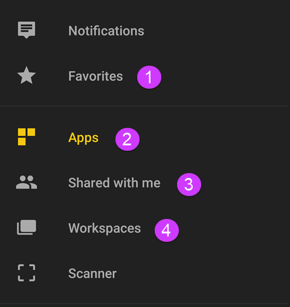
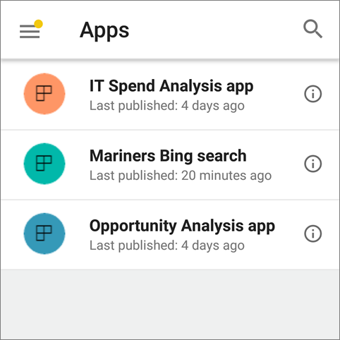
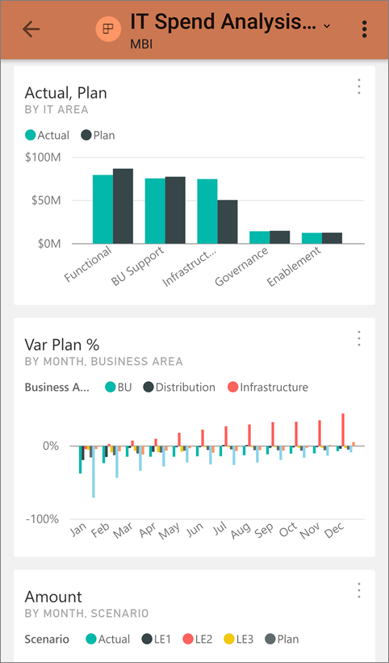
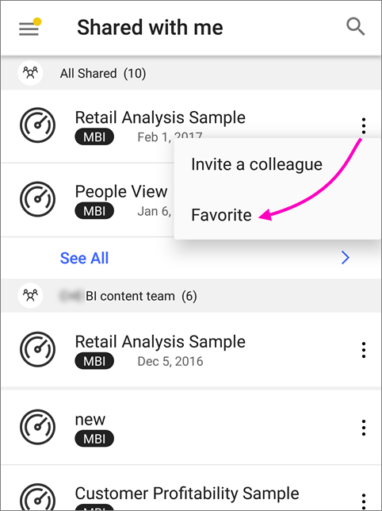

<properties 
   pageTitle="Find your dashboards and reports on your mobile device"
   description="Dashboards and reports are in different places in the Power BI mobile apps, depending on where they came from."
   services="powerbi" 
   documentationCenter="" 
   authors="maggiesMSFT" 
   manager="erikre" 
   backup=""
   editor=""
   tags=""
   qualityFocus="no"
   qualityDate=""/>
 
<tags
   ms.service="powerbi"
   ms.devlang="NA"
   ms.topic="article"
   ms.tgt_pltfrm="NA"
   ms.workload="powerbi"
   ms.date="04/25/2017"
   ms.author="maggies"/>

# View your dashboards and reports on your mobile device

Applies to:

|  |  |  |  |  |
|:------------------------|:----------------------------|:----------------------------|:----------------------------------------|:-----------------|
| iPhones | iPads | Android phones | Android tablets | Windows 10 devices |

Your dashboards and reports are in different locations in the Power BI mobile apps, depending on where they came from. 

1. [Favorites](powerbi-mobile-find-content-mobile-devices.md/#1-favorites)
2. [Apps](powerbi-mobile-find-content-mobile-devices.md/#2-apps)
3. [Shared with me](powerbi-mobile-find-content-mobile-devices.md/#3-shared-with-me)
4. [Workspaces](powerbi-mobile-find-content-mobile-devices.md/#4-workspaces)

## 1 Favorites 

Collect the dashboards and apps you view most often by tagging them as favorites. Read more about [favorites in the Power BI mobile apps](powerbi-mobile-favorites.md).

## 2 Apps

An app is a collection of dashboards and reports purpose-built by your organization to deliver key metrics for faster and easier data-driven decisions. In the Power BI service ([https://powerbi.com](https://powerbi.com)), apps are easy to discover and install. After you install them, you can view them from any device. 

With apps you automatically get all the updates the author makes, and the author also controls how often the data is scheduled to refresh. You don't need to worry about keeping up-to-date with the author’s changes.

### Get an app on a mobile device

In the Power BI mobile apps, you can view all the apps you've already installed, but you can't search for other apps from the Power BI mobile apps. The app owner can send you a direct link to the app. When you click the link, the app downloads to your account and opens in the mobile app.

You can open the dashboards and reports in the app, and even share them with others. If the people you share them with have permission for the app, then they get a message asking if they want to add the app to their Apps. 

## 3 Shared with me

Here you'll find dashboards that colleagues have shared with you. You can filter by the owner of the dashboard or search to find what you're looking for. For shared content you visit frequently, you can favorite it right from **Shared with me** by tapping the ellipsis (...).

You can open the dashboards and reports in the app, and if you have sharing permission, you can even share them with others.

## 4 Workspaces

Also called *App workspaces*, these are staging environments in the Power BI service ([https://powerbi.com](https://powerbi.com)) where you can collaborate with colleagues on a collection of dashboards and reports. When the collection is ready, you publish it as an *app* -- to individuals, groups, or your entire organization. 

App workspaces are the next generation of groups and group workspaces.

In the mobile apps, you can view and interact with content in any workspace where you're a member or an admin. You can't publish apps from workspaces in the mobile apps.

## See also

- [Get started with Power BI](powerbi-service-get-started.md)
- Questions? [Try asking the Power BI Community](http://community.powerbi.com/)
