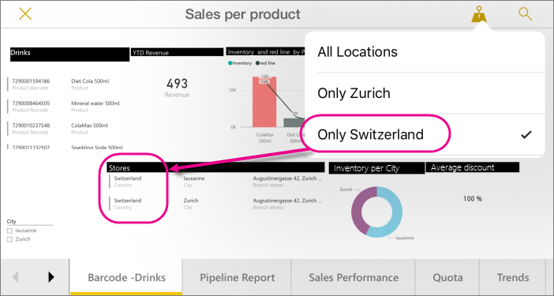

<properties 
   pageTitle="Filter a report by location in the Power BI mobile apps for iOS"
   description="Learn how you can filter a report by your location in the Microsoft Power BI  mobile apps for iOS, if the report owner set geographic tags."
   services="powerbi" 
   documentationCenter="" 
   authors="maggiesMSFT" 
   manager="mblythe" 
   editor=""
   tags=""
   qualityFocus="no"
   qualityDate=""/>
 
<tags
   ms.service="powerbi"
   ms.devlang="NA"
   ms.topic="article"
   ms.tgt_pltfrm="NA"
   ms.workload="powerbi"
   ms.date="06/16/2016"
   ms.author="maggies"/>

# Filter a report by location in the Power BI mobile apps for iOS

When you look at a Power BI report on your iPad, iPhone, or iPod Touch, do you see a little pushpin icon in the upper-right corner? If so, then you can filter that report based on your physical location.

## Filter your report by your location

1. Open a report in the Power BI mobile app on your iOS device.

3. Tap the push pin  in the upper-right corner. You can filter on either city, state/province, or country/region, depending on how the report creator set up the report. The filter only lists options that match your current location.

    

## Why do only some reports have location tags?
 because the report creator has tagged the geographic data in the report
When your colleagues create reports in Power BI Desktop, they can categorize geographical data for a column. Then, when you or your colleagues view that report in the Power BI mobile app for iOS, Power BI automatically provides geographical filters that match where you are.

Read more about [categorizing geographical data](powerbi-desktop-mobile-geofiltering.md) in Power BI Desktop.

### See also  
- [Data categorization in Power BI Desktop](powerbi-desktop-data-categorization.md)  
- [Get started with the iPhone app for Power BI](powerbi-mobile-iphone-app-get-started.md)  
- [Get started with Power BI](powerbi-service-get-started.md)  
