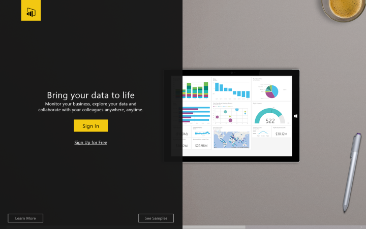

<properties 
   pageTitle="Get the Power BI for Windows app"
   description="Get the Power BI for Windows app"
   services="powerbi" 
   documentationCenter="" 
   authors="maggiesMSFT" 
   manager="mblythe" 
   editor=""
   tags=""/>
 
<tags
   ms.service="powerbi"
   ms.devlang="NA"
   ms.topic="article"
   ms.tgt_pltfrm="NA"
   ms.workload="powerbi"
   ms.date="02/18/2016"
   ms.author="maggies"/>

# Get the Power BI for Windows app  

## Download the Power BI for Windows app  
[Download the Power BI for Windows app](http://go.microsoft.com/fwlink/?LinkId=526478) from the Windows Store.

## Supported devices  
The Microsoft Power BI for Windows app runs on all Windows 10 devices, including Windows 10 phones. It doesn't run on Windows 8 devices or phones, or Windows RT devices.

## Sign up and sign in  
If you haven't signed up yet, go to [Power BI](http://powerbi.com) to sign up for a place to create and store dashboards to bring your data together. Then sign in to Power BI from your Windows device to see your own dashboards from anywhere.

1.  Tap [Sign up](http://go.microsoft.com/fwlink/?LinkID=513879) to create a Power BI account.  
    Start [creating your own dashboards and reports](powerbi-service-get-started.md).

2.  Open the Power BI for Windows app, and tap **Sign in **to view your dashboards and reports.  
	

More about the [Power BI for Windows app](powerbi-service-windows-app-get-started.md).