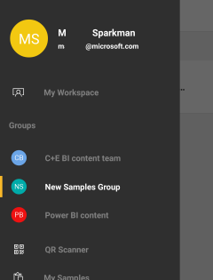
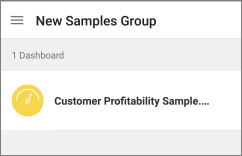

<properties 
   pageTitle="Groups in the Android app"
   description="Groups in the Android app for Power BI"
   services="powerbi" 
   documentationCenter="" 
   authors="maggiesMSFT" 
   manager="mblythe" 
   editor=""
   tags=""
   qualityFocus="no"
   qualityDate=""/>
 
<tags
   ms.service="powerbi"
   ms.devlang="NA"
   ms.topic="article"
   ms.tgt_pltfrm="NA"
   ms.workload="powerbi"
   ms.date="04/27/2016"
   ms.author="maggies"/>

# Groups in the Android app for Power BI  

Power BI groups offer a powerful collaborative experience built on Office 365 groups. Read more about [groups in Office 365](https://support.office.com/Article/Find-help-about-Groups-in-Office-365-7a9b321f-b76a-4d53-b98b-a2b0b7946de1) and [groups in Power BI](powerbi-service-create-a-group-in-power-bi.md). Groups are available with the [Power BI Pro](powerbi-power-bi-pro-content-what-is-it.md) experience.

You [create groups in the Power BI service](powerbi-service-create-a-group-in-power-bi.md), and add dashboards to them there.

Then you see and interact with group dashboards in the Microsoft [Power BI for Android app](powerbi-mobile-android-app-get-started.md).  

## Interact with groups content  
1.  Open the Android app for Power BI.

    Need to [download the Android app](http://go.microsoft.com/fwlink/?LinkID=544867) first?

2.  Under My Workspace, select a group.  

    

3.  Your group page displays the dashboards that have been published to the group workspace.  

    

4.  [Select a dashboard](powerbi-mobile-dashboards-in-the-android-app.md) to open and view it.  

### See also  
[Download the Android app](http://go.microsoft.com/fwlink/?LinkID=544867) from Google play  
[Get started with the Android app for Power BI](powerbi-mobile-android-app-get-started.md)  
[Get started with Power BI](powerbi-service-get-started.md)  