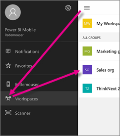

<properties 
   pageTitle="Groups in the iPhone app"
   description="Power BI groups are built on Office 365 groups. Read about viewing and interacting with group dashboards in the Power BI iOS mobile app for the iPhone."
   services="powerbi" 
   documentationCenter="" 
   authors="maggiesMSFT" 
   manager="erikre" 
   backup=""
   editor=""
   tags=""
   qualityFocus="no"
   qualityDate=""/>
 
<tags
   ms.service="powerbi"
   ms.devlang="NA"
   ms.topic="article"
   ms.tgt_pltfrm="NA"
   ms.workload="powerbi"
   ms.date="02/06/2017"
   ms.author="maggies"/>

# Groups in the iPhone app (Power BI for iOS)  

Power BI groups offer a powerful collaborative experience built on Office 365 groups. Read more about [groups in Office 365](https://support.office.com/article/Create-a-group-in-Office-365-7124dc4c-1de9-40d4-b096-e8add19209e9). Groups are available with the paid Power BI experience. 

You [create a group in the Power BI service](powerbi-service-create-a-group-in-power-bi.md). Then you see and interact with group dashboards in the Microsoft [Power BI iOS app for the iPhone](powerbi-mobile-ipad-app-get-started.md). 

Power BI sends a notification to your iPhone whenever someone adds a new dashboard to any group you belong to. 

## Interact with Power BI groups  
1.  Open the Power BI for iOS app for the iPhone. 

    Need to [download and install the iOS app for the iPhone](http://go.microsoft.com/fwlink/?LinkId=522062) first?

2.  Tap the global navigation button , tap Workspaces , and select a group. 
 
    

3.  Your group page displays the dashboards that have been published to the group workspace.  

    

4.  [Select a dashboard](powerbi-mobile-create-dashboard.md) to open and view it.

### See also
- [Get started with the iPhone app for Power BI](powerbi-mobile-iphone-app-get-started.md)
- [Get started with Power BI](powerbi-service-get-started.md)
- Questions? [Try asking the Power BI Community](http://community.powerbi.com/)  