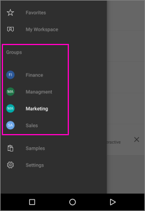
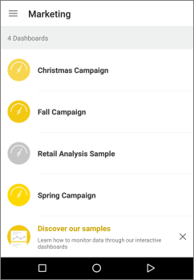

<properties 
   pageTitle="Groups in the iPhone app (Power BI for iOS)"
   description="Groups in the iPhone app (Power BI for iOS)"
   services="powerbi" 
   documentationCenter="" 
   authors="jastru" 
   manager="mblythe" 
   editor=""
   tags=""/>
 
<tags
   ms.service="powerbi"
   ms.devlang="NA"
   ms.topic="article"
   ms.tgt_pltfrm="NA"
   ms.workload="powerbi"
   ms.date="10/15/2015"
   ms.author="jastru"/>

# Groups in the iPhone app (Power BI for iOS)  

Power BI groups offer a powerful collaborative experience built on Office 365 groups. Read more about [groups in Office 365](https://support.office.com/Article/Find-help-about-Groups-in-Office-365-7a9b321f-b76a-4d53-b98b-a2b0b7946de1) and [groups in Power BI](powerbi-service-groups.md). Groups are available with the paid Power BI experience.

You [create a group in the Power BI service](powerbi-service-create-a-group-in-power-bi.md).

Then you see and interact with group dashboards in the Microsoft [Power BI iOS app for the iPhone](powerbi-mobile-ipad-app-get-started.md). 

## Interact with Power BI groups  
1.  Open the Power BI for iOS app for the iPhone. 

    Need to [download and install the iOS app for the iPhone](http://go.microsoft.com/fwlink/?LinkId=522062) first?

2.  Under My Workspace, select a group.  
    

3.  Your group page displays the dashboards that have been published to the group workspace.  
    

4.  [Select a dashboard](powerbi-mobile-dashboards-in-the-iphone-app.md) to open and view it.

More about [the iPad app](powerbi-mobile-iphone-app-get-started.md) for Power BI.  