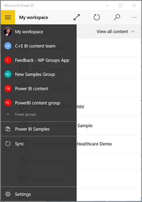
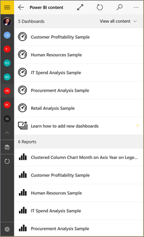

<properties 
   pageTitle="Groups in the Power BI mobile app for Windows 10"
   description="Groups in the Power BI mobile app for Windows 10"
   services="powerbi" 
   documentationCenter="" 
   authors="maggiesMSFT" 
   manager="mblythe" 
   backup=""
   editor=""
   tags=""
   qualityFocus="no"
   qualityDate=""/>
 
<tags
   ms.service="powerbi"
   ms.devlang="NA"
   ms.topic="article"
   ms.tgt_pltfrm="NA"
   ms.workload="powerbi"
   ms.date="04/28/2016"
   ms.author="maggies"/>

# Groups in the Power BI mobile app for Windows 10  

Power BI groups offer a powerful collaborative experience built on Office 365 groups. Read more about [groups in Office 365](https://support.office.com/article/Create-a-group-in-Office-365-7124dc4c-1de9-40d4-b096-e8add19209e9). Groups are available with the paid Power BI Pro experience.

You [create a group in the Power BI service](powerbi-service-create-a-group-in-power-bi.md). Then you see and interact with group dashboards in the Microsoft [Power BI mobile app for Windows 10](powerbi-mobile-win10phone-app-get-started.md).  

## Interact with groups content  
1.  Open the Power BI mobile app for Windows 10.

    Need to [download the app](http://go.microsoft.com/fwlink/?LinkID=526478) first?

2.  Tap the navigation icon , then under My Workspace, select a group.  

    

3.  Your group page displays the dashboards that have been published to the group workspace.  

    

4.  [Select a dashboard](powerbi-mobile-dashboards-in-the-win10phone-app.md) to open and view it.  

### See also  
- [Download the Power BI mobile app for Windows 10](http://go.microsoft.com/fwlink/?LinkID=526478) from the Windows Store  
- [Get started with thePower BI mobile app for Windows 10](powerbi-mobile-win10phone-app-get-started.md)  
- [Get started with Power BI](powerbi-service-get-started.md)  
