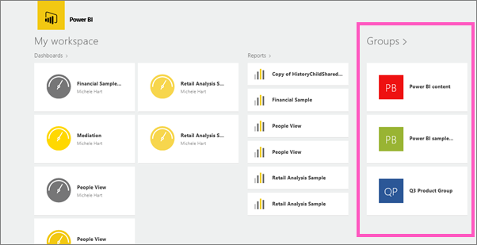

<properties 
   pageTitle="Groups in the Power BI for Windows app"
   description="Groups in the Power BI for Windows app"
   services="powerbi" 
   documentationCenter="" 
   authors="maggiesMSFT" 
   manager="mblythe" 
   editor=""
   tags=""/>
 
<tags
   ms.service="powerbi"
   ms.devlang="NA"
   ms.topic="article"
   ms.tgt_pltfrm="NA"
   ms.workload="powerbi"
   ms.date="11/23/2015"
   ms.author="maggies"/>
# Groups in the Power BI for Windows app

Power BI groups offer a powerful collaborative experience built on Office 365 groups. Read more about [groups in Office 365](https://support.office.com/Article/Find-help-about-Groups-in-Office-365-7a9b321f-b76a-4d53-b98b-a2b0b7946de1) and [groups in Power BI](powerbi-service-groups.md). Groups are available with the paid Power BI experience.

You [create a group in the Power BI service](powerbi-service-create-a-group-in-power-bi.md).

Then you see and interact with group dashboards and reports in the Microsoft [Power BI for Windows app](powerbi-service-windows-app-get-started.md). 

## Interact with groups content

1.  Open the Power BI for Windows app.

    Need to [download and install the Power BI for Windows app](http://go.microsoft.com/fwlink/?LinkId=526478) first?

2.  From My Workspace, select a group.

    

3.  Your group page displays the dashboards and reports that have been published to the group workspace.

    

4.  [Select a dashboard](powerbi-mobile-dashboards-in-the-windows-app.md) or [select a report](powerbi-mobile-reports-in-the-windows-app.md) to open and view it.

More about the [Power BI for Windows app](powerbi-service-windows-app-get-started.md).

