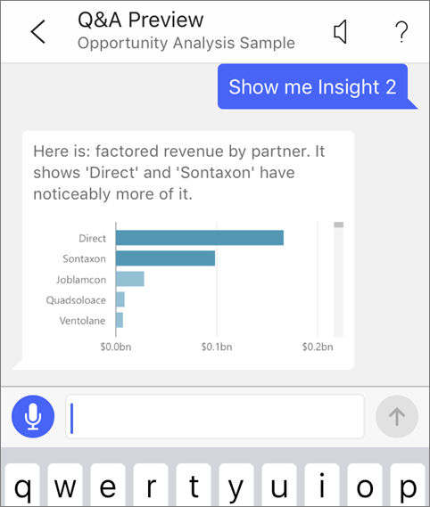
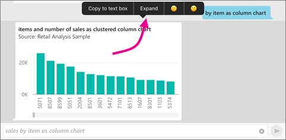
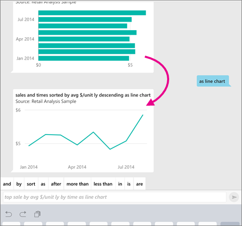
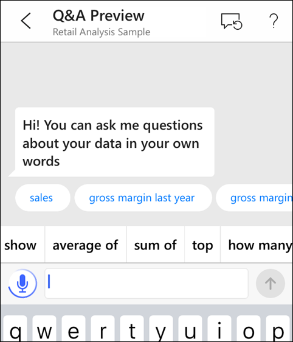

<properties
   pageTitle="Ask questions about your data in the iOS mobile apps (Tutorial)"
   description="Try asking questions about this sample data in your own words with the Q&A on iOS on your iPad, iPhone, and iPod Touch."
   services="powerbi"
   documentationCenter=""
   authors="maggiesMSFT"
   manager="erikre"
   backup=""
   editor=""
   tags=""
   qualityFocus="no"
   qualityDate=""/>

<tags
   ms.service="powerbi"
   ms.devlang="NA"
   ms.topic="article"
   ms.tgt_pltfrm="NA"
   ms.workload="powerbi"
   ms.date="08/01/2017"
   ms.author="maggies"/>

# Ask questions about your data in the iOS mobile apps (Tutorial)

Applies to:

|  |  |
|:------------------------|:----------------------------|
| iPhones | iPads |

The easiest way to learn about your data in to ask questions about it in your own words. In the Microsoft Power BI app for iOS devices, you can view featured insights, and type or say a question. In this tutorial, you ask questions about sample data.

Q&A for iOS is a conversational BI experience that replaces the Q&A feature in Power BI mobile apps for iOS devices. Q&A for iOS still accesses underlying Q&A data in the Power BI service [(https://powerbi.com)](https://powerbi.com), but it also delivers meaningful data insights in context, as part of an interactive, conversational BI experience.

## Download the samples

If you haven't already downloaded the Retail Analysis and Opportunity Analysis samples in the Power BI service, that's the first step.

* In your workspace on the Power BI service ([https://powerbi.com](https://powerbi.com)):

   * Select **Get Data** > **Samples** > **Opportunity Analysis Sample** > **Connect**.
   * After the Opportunity Analysis Sample finishes downloading, select **Get Data** > **Samples** > **Retail Analysis Sample** > **Connect**.

## Try featured insights

1. On your iPhone or iPad, open the Power BI app and navigate to the Opportunity Analysis Sample dashboard.

1. Tap the Q&A for iOS icon  from the action menu at the bottom of the page (at the top of the page on an iPad).

     

     Power BI Q&A for iOS offers some suggestions to get started.

     

3. Tap **featured insights**.

     Q&A for iOS suggests some insights.

4. Scroll to the right and tap **Insight 2**.

    

     Q&A for iOS displays Insight 2.

    

5. Tap the chart to open it in focus mode.

    

6. Tap the arrow in the upper-left corner to go back to the Q&A for iOS experience.

## Try asking questions on your iPhone or iPad

1. On your iPhone or iPad, open the Power BI app and navigate to the Retail Analysis Sample dashboard.
2. Tap the Q&A for iOS icon  from the action menu at the bottom of the page (at the top of the page on an iPad).
     Q&A for iOS offers some suggestions to get started.
3. Type **show**, tap **sales** from the suggestion list > **Send** .

    

4. Tap **by** from the keywords, then tap **item** from the suggestion list > **Send** .

    

5. Tap **as** from the keywords, tap the column chart icon , then tap **Send** .

6. Long-tap the resulting chart, then tap **Expand**.

    

    The chart opens in focus mode in the app.

    

7. Tap the arrow in the upper-left corner to go back to the Q&A for iOS chat window.

9. Tap the X at the right of the text box to delete the text and start over.

8. Try a new question: Tap **top** from the keywords, tap **sale by avg $/unit ly** > **Send** .

    

9. Choose **by** from the keywords, tap **time** from the suggestion list at the top > **Send** .

    

10. Type **as**, pick the line chart icon  from the suggestion list > **Send** .

    

## Try saying your questions

You can now ask questions about your data in the Power BI mobile app by speaking instead of typing.

1. Tap the Q&A for iOS icon  from the action menu at the bottom of the page (at the top of the page on an iPad).

2. Tap the microphone icon .

    

4. When the microphone icon is active, start speaking. For example, say "average unit price by time", then tap **Send** .

    

### Questions about privacy when using speech-to-text?

See the Speech Recognition section of [What's New in iOS](https://go.microsoft.com/fwlink/?linkid=845624) in the Apple iOS Developer Guides.

## Help and feedback

- Need help? Just say "Hi" or "Help", and you'll get assistance with starting a new question.

- Care to provide feedback on the results? Long-tap a chart or other result, then tap the smiley or frowny face.

    

    Your feedback is anonymous, and helps us improve our answers to questions.

## Enhance your Q&A for iOS results

You can improve the results you and your customers get when they use Q&A for iOS on a dataset, either by asking more targeted questions or by enhancing the dataset.

### How to ask questions
- Follow these [tips for asking questions in Q&A](powerbi-service-q-and-a-tips.md) in the Power BI service or Q&A for iOS in your iOS mobile app.

### How to enhance the dataset  
- Enhance the dataset in Power BI Desktop or in the Power BI service to [make your data work well with Q&A and Q&A for iOS](powerbi-service-make-your-data-work-well-with-q-and-a.md).

## See also

- [Q&A in the Power BI service](powerbi-service-q-and-a.md)
- Questions? Check the [Mobile apps section of the Power BI Community](https://go.microsoft.com/fwlink/?linkid=839277)
