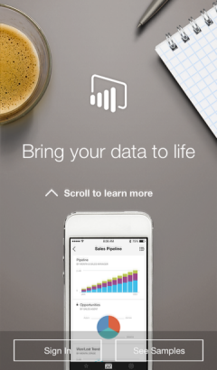

<properties 
   pageTitle="Get started with the iPhone app (Power BI for iOS)"
   description="Get started with the iPhone app (Power BI for iOS)"
   services="powerbi" 
   documentationCenter="" 
   authors="v-aljenk" 
   manager="mblythe" 
   editor=""
   tags=""/>
 
<tags
   ms.service="powerbi"
   ms.devlang="NA"
   ms.topic="article"
   ms.tgt_pltfrm="NA"
   ms.workload="powerbi"
   ms.date="10/14/2015"
   ms.author="v-aljenk"/>

# Get started with the iPhone app (Power BI for iOS)

The iPhone app for Microsoft Power BI for iOS brings Power BI to your pocket, with live, touch-enabled mobile access to your business information. View and interact with your company dashboards from anywhere.

**NOTE**: Your iPhone needs to be running at least iOS 8.0.

Maybe a colleague sent you a link to a dashboard? Now you can view it on your iPhone.

Bring your own data together and create dashboards and reports in [Power BI](http://go.microsoft.com/fwlink/?LinkID=513879 "Power BI to sign up"). Then interact with your dashboards, explore the data, and share them with the iPhone app for Power BI.

-   **Download**   [Download the iPhone app](http://go.microsoft.com/fwlink/?LinkId=522062 "Download the iPhone app") from the Apple App Store.

-   **Sign up**    Go to [Power BI to sign up](http://go.microsoft.com/fwlink/?LinkID=513879 "Power BI to sign up") for the service. Now you have a place to create dashboards to bring your data together.

-   **Sign in**    Then [sign in to Power BI](http://go.microsoft.com/fwlink/?LinkId=522061 "sign in to Power BI") from your iPhone, to see your dashboards from anywhere.

-   **Start with samples**    Even without signing up or signing in, after you download the app you can view the samples. Or go back to the samples whenever you want from the dashboards home page.

## Now what?

What else you can do in the iPhone app for Power BI?

-   View your [dashboards](http://support.powerbi.com/knowledgebase/articles/527051).

-   Interact with the [tiles](http://support.powerbi.com/knowledgebase/articles/527054) on your dashboards.

-   Create [favorites](http://support.powerbi.com/knowledgebase/articles/527060).

-   Set [data alerts](http://support.powerbi.com/knowledgebase/articles/527063) for your data.

-   Share [dashboards](http://support.powerbi.com/knowledgebase/articles/527075).

-   Annotate and share [tiles](http://support.powerbi.com/knowledgebase/articles/527099).

### See Also

[Get started with the iPad app for Power BI](http://support.powerbi.com/knowledgebase/articles/467172)

[Get started with Power BI](http://support.powerbi.com/knowledgebase/articles/430814)
