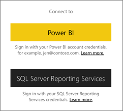
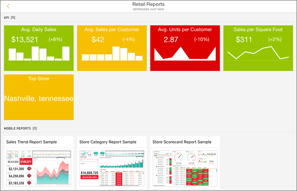
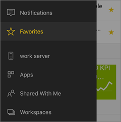

<properties 
   pageTitle="Get started with the iPad mobile app"
   description="Learn how the Microsoft Power BI for iOS app on the iPad brings Power BI to your pocket, with mobile access to business information on premises and in the cloud."
   services="powerbi" 
   documentationCenter="" 
   authors="maggiesMSFT" 
   manager="erikre" 
   backup=""
   editor=""
   tags=""
   qualityFocus="identified"
   qualityDate="08/08/2016"/>
 
<tags
   ms.service="powerbi"
   ms.devlang="NA"
   ms.topic="article"
   ms.tgt_pltfrm="NA"
   ms.workload="powerbi"
   ms.date="05/14/2017"
   ms.author="maggies"/>

# Get started with Power BI for iOS on the iPad  

The Microsoft Power BI for iOS on the iPad delivers the mobile BI experience for Power BI, Power BI Report Server, and Reporting Services. View and interact with your company dashboards on premises and in the cloud from anywhere, with live, touch-enabled mobile access. Explore the data in dashboards, and share with your colleagues in email or text messages. 

You create Power BI reports in Power BI Desktop, and publish them:

- Publish them to the [Power BI service](powerbi-service-get-started.md), and create dashboards.
- Publish them on-premises to Power BI Report Server.

Then in the Power BI app for the iPad, you interact with your dashboards and reports, whether on-premises or in the cloud.

Find out [what's new in the Power Bi mobile apps](powerbi-mobile-whats-new-in-the-mobile-apps.md).

## Download the iOS app for the iPad  
[Download the iPad app](http://go.microsoft.com/fwlink/?LinkId=522062) from the Apple App Store.

> [AZURE.NOTE]  Your iPad needs to be running at least iOS 9.0. 

## Sign up for the Power BI service

Go to Power BI (https://powerbi.com) to sign up for the service, if you haven't already. It's free.

## Get started with the Power BI app 

1.  In the iPad, open the Power BI app.
  
2.  To view your Power BI dashboards and reports, tap **Power BI**. Sign in with the same credentials as your Power BI account on the web. 

    To view your Reporting Services mobile reports and KPIs, tap **SQL Server Reporting Services**. Sign in with your SQL Server Reporting Services credentials.

    

    > [AZURE.TIP] When you're in the app, tap the global navigation button  in the upper-left corner to go between the two services. 

## Try the Power BI and Reporting Services samples  
Even without signing up, you can play with the Power BI and Reporting Services samples. After you download the app, you can view the samples or get started. Go back to the samples whenever you want from the dashboards home page.

### Power BI samples

You can view and interact with the Power BI dashboard samples, but there are a few things you can't do with them. You can't open the reports behind the dashboards, share the samples with others, or make them your favorites.

1.   Tap the global navigation button  in the upper-left corner, then tap the Settings icon .
  
2.   Tap **Power BI samples**, then pick a role and explore the sample dashboard for that role.  

    

    > [AZURE.NOTE] Not all features are available in the samples. For example, you can't view the sample reports that underlie the dashboards. 

### Reporting Services mobile report samples

1.   Tap the global navigation button  in the upper-left corner, then tap the Settings icon .

2.  Tap **Reporting Services samples**, then open either the Retail Reports or the Sales Reports folder to explore their KPIs and mobile reports.

    

## Find your content in the Power BI mobile apps

Your dashboards and reports are stored in different locations in the Power BI mobile apps, depending on where they came from. Read  about [finding your content in the mobile apps](powerbi-mobile-find-content-mobile-devices.md). Plus you can always search for anything you have in the Power BI mobile apps. 

## Search for a dashboard or report

* Tap the magnifying glass in the upper-right corner , then type the term to find.

    

    By default it searches all dashboards and reports, but you can search just one or the other.

## View your favorite dashboards, KPIs, and reports

You can view all of your favorite Power BI dashboards, together with Reporting Services KPIs and mobile reports, on the Favorites page in the mobile apps. When you make a dashboard a *favorite* in the Power BI mobile app, you can access it from all of your devices, including the Power BI service in your browser. 

-  Tap **Favorites**.

    
   
    Your Power BI favorites and your favorites from the Reporting Services web portal are all on this page.

    

Read more about [favorites in the Power BI mobile apps](powerbi-mobile-favorites.md).

## Enterprise support for the Power BI mobile apps

Organizations can use Microsoft Intune to manage devices and applications, including the Power BI mobile apps for Android and iOS.

Microsoft Intune lets organizations control items like requiring an access pin, controlling how data is handled by the application, and even encrypting application data when the app isn't in use.

> [AZURE.NOTE] If you use the Power BI mobile app on your iPad and your organization has configured Microsoft Intune MAM, then background data refresh is turned off. The next time you enter the app, Power BI refreshes the data from the Power BI service on the web.

Read more about [configuring Power BI mobile apps with Microsoft Intune](powerbi-admin-mobile-intune.md). 

## Next steps

Here are some other things you can do in the iPad app with dashboards in Power BI, and Reporting Services mobile reports and KPIs in the Reporting Services web portal.

### Power BI dashboards and reports

-   View [your apps](powerbi-service-what-are-apps.md).
-   View your [Power BI dashboards](powerbi-mobile-create-dashboard.md).
-   [Ask questions of your data](powerbi-mobile-ios-qna.md) in your own words with Q&A
-   [Scan a Power BI QR code](powerbi-mobile-qr-code-for-tile.md)  to open a related dashboard tile or report.
-   [Set data alerts](powerbi-mobile-set-data-alerts-in-the-iphone-app.md) to get notifications when your data changes.
-   View [notifications about updates to your Power BI account](powerbi-mobile-notification-center.md), such as dashboards that colleagues share with you.
   
    

### Reports and KPIs on the Power BI Report Server and Reporting Services web portals

- [View reports and KPIs on the web portal](powerbi-mobile-iphone-kpis-mobile-reportss.md) in the Power BI mobile app for Android devices.
- Create [KPIs on the web portal](https://docs.microsoft.com/sql/reporting-services/working-with-kpis-in-reporting-services).
- Create [reports in Power BI Desktop and publish them on the Power BI Report Server](reportserver-quickstart-powerbi-report.md) web portal

### See also  
- [Get started with the iPhone app for Power BI](powerbi-mobile-ipad-app-get-started.md)  
- [Get started with Power BI](powerbi-service-get-started.md)  
- Questions? Try asking the [Power BI Community](http://community.powerbi.com/)

