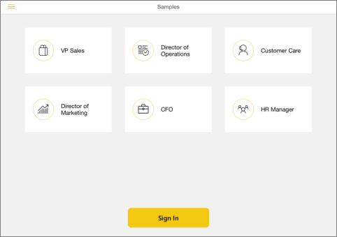

<properties 
   pageTitle="Get started with the iPad app"
   description="Get started with the iPad app (Power BI for iOS)"
   services="powerbi" 
   documentationCenter="" 
   authors="maggiesMSFT" 
   manager="mblythe" 
   editor=""
   tags=""/>
 
<tags
   ms.service="powerbi"
   ms.devlang="NA"
   ms.topic="article"
   ms.tgt_pltfrm="NA"
   ms.workload="powerbi"
   ms.date="11/25/2015"
   ms.author="maggies"/>

# Get started with the iPad app (Power BI for iOS)  

The iPad app for Microsoft Power BI for iOS brings the mobile BI experience to Power BI. With live, touch-enabled mobile access to your important business information, you can view and interact with your company dashboards and reports easily, from anywhere. Explore the data in your dashboards, and share them with your colleagues in email or text messages.  

Maybe a colleague sent you a link to a dashboard? Now you can view it on your iPad.

Or bring your own data together and create [dashboards and reports in Power BI](powerbi-service-get-started.md). Then interact with your dashboards and reports, explore the data in them, and share snapshots with the iPad app for Power BI.

## Download the iOS app for the iPad  
[Download the iPad app](http://go.microsoft.com/fwlink/?LinkId=522062) from the Apple App Store.

>**Note:** Your iPad needs to be running at least iOS 8.0. 

## Sign up
Go to [Power BI to sign up](http://go.microsoft.com/fwlink/?LinkID=513879) for the service. 

Now you have a place to create dashboards to bring your data together. 

## Sign in  

Then sign in to Power BI from your iPad, to see your own dashboards from anywhere.

1.  Tap [Sign up](http://go.microsoft.com/fwlink/?LinkID=513879) to create a Power BI account.

2.    Start [creating your own dashboards and reports](powerbi-service-get-started.md).

3.  Back in the iPad app, tap [Sign in](http://go.microsoft.com/fwlink/?LinkId=522061) to view your dashboards and reports.

## Get started with samples  
Even without signing up or signing in, you can play with the samples. After you download the app, you can view the samples or sign in. Go back to the samples whenever you want from the dashboards home page.

-   Tap **see our samples**, then pick a role and explore the sample dashboard for that role.  

    

    >**NOTE**:  Not all features are available in the samples. For example, you can't view the sample reports that underlie the dashboards. 

## What else?  
See what else you can do in the iPad app for Power BI.

-   View your [dashboards](powerbi-mobile-dashboards-on-the-ipad-app.md).

-   Interact with [tiles on your dashboards](powerbi-mobile-tiles-in-the-ipad-app.md).

-   Create [favorites](powerbi-mobile-favorites-on-the-ipad-app.md).

-   Open [reports](powerbi-mobile-reports-on-the-ipad-app.md) from your dashboard.

-   [Share dashboards](powerbi-mobile-share-dashboards-from-the-ipad-app.md).

-   [Annotate and share a snapshot](powerbi-mobile-annotate-and-share-a-snapshot-from-the-ipad-app.md) of a tile.

-   View your [groups' dashboards and reports](powerbi-service-mobile-groups-in-the-ipad-app.md).

### See also  
[Get started with the iPhone app for Power BI](powerbi-mobile-ipad-app-get-started.md)  
[Get started with Power BI](powerbi-service-get-started.md)  