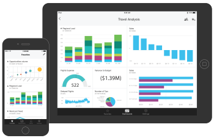

<properties 
   pageTitle="iPad and iPhone apps"
   description="iPad and iPhone apps (Power BI for iOS)"
   services="powerbi" 
   documentationCenter="" 
   authors="maggiesMSFT" 
   manager="mblythe" 
   editor=""
   tags=""/>
 
<tags
   ms.service="powerbi"
   ms.devlang="NA"
   ms.topic="article"
   ms.tgt_pltfrm="NA"
   ms.workload="powerbi"
   ms.date="11/23/2015"
   ms.author="maggies"/>
# iPad and iPhone apps (Power BI for iOS)

The iPad and iPhone apps for Microsoft Power BI for iOS deliver the mobile BI experience. They provide live, touch-enabled mobile access to your important business information, so you can view and interact with your company dashboards and reports from anywhere. Explore the data in your dashboards, and share them with your colleagues in email or text messages.

Download the [iPad or iPhone app](http://go.microsoft.com/fwlink/?LinkId=522062 "iPad or iPhone app") from the Apple App Store.

Go to [Power BI](http://go.microsoft.com/fwlink/?LinkID=513879) to sign up for the Power BI service.

## iPad app for Power BI

Get started with the [iPad app for Power BI for iOS](powerbi-mobile-iphone-app-get-started.md).

## iPhone app for Power BI

Get started with the [iPhone app for Power BI for iOS](powerbi-mobile-ipad-app-get-started.md).

## Get started with Power BI

Start by [getting your data](powerbi-service-get-data.md) from sources as varied as Excel spreadsheets, SQL Server Analysis Services, Salesforce, and and GitHub.

Then bring your data together by creating [dashboards](powerbi-service-dashboards.md) and [reports](powerbi-service-reports.md) in Power BI.

Now experience them in the iPad and iPhone apps.

### See also

[Get started with Power BI](powerbi-service-get-started.md)

