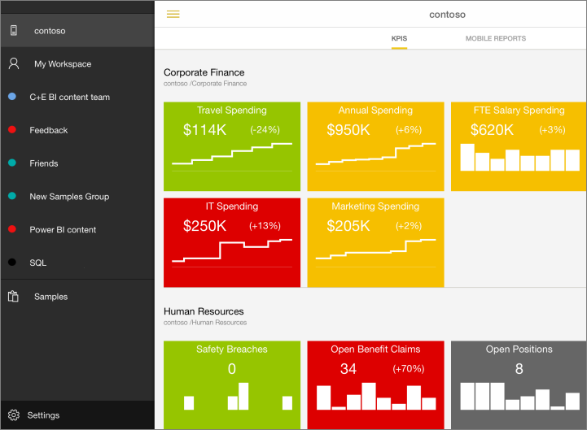
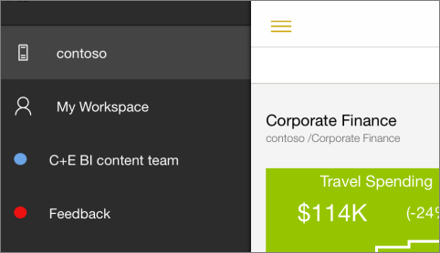

<properties 
   pageTitle="View SQL Server mobile reports and KPIs in the iPad app"
   description="View SQL Server mobile reports and KPIs in the iPad app (Power BI for iOS)"
   services="powerbi" 
   documentationCenter="" 
   authors="maggiesMSFT" 
   manager="mblythe" 
   editor=""
   tags=""
   qualityFocus="no"
   qualityDate=""/>
 
<tags
   ms.service="powerbi"
   ms.devlang="NA"
   ms.topic="article"
   ms.tgt_pltfrm="NA"
   ms.workload="powerbi"
   ms.date="02/08/2016"
   ms.author="maggies"/>

# View SQL Server mobile reports and KPIs in the iPad app (Power BI for iOS)  

The iPad app for Microsoft Power BI for iOS offers live, touch-enabled mobile access to your important on-premises business information. 

Create SQL Server mobile reports for your on-premises data with the SQL Server Mobile Report Publisher, and publish them to your Reporting Services web portal. You can also create KPIs, right on the web portal. Then view the mobile reports and KPIs on the iPad app for Power BI. Read about [creating and publishing SQL Server mobile reports](https://msdn.microsoft.com/library/mt652547.aspx). 

>**Note:** Your iPad needs to be running at least iOS 8.0. 

## Connect to a server to view SQL Server mobile reports 

1.  In the iPad, open the Power BI app.
  
2.  To view your SQL Server mobile reports and KPIs, tap **Reporting Services**.

    

3. Tap the options icon  in the upper-left corner, and tap **Connect**.

    

4. Give the server a name, and fill in the server address and your user name and password, in this format:

    

    >**Note**: Don't include **http** or **https** in front of the connection string. Just *servername*.com/reports_preview.

5.  Now you see the server in the left navigation bar.

    

>**Tip**: Tap the options icon  anytime to go between your SQL Server mobile reports and your dashboards in the Power BI service. 

## View SQL Server KPIs and mobile reports in the Power BI app

Tap the **KPIs** or **Mobile Reports** tab. 

- Tap a KPI to see it in focus mode.

    

- Tap a mobile report to open and interact with it in the Power BI app.

    

The SQL Server KPIs and mobile reports are displayed in the same folders they're in on the Reporting Services web portal. 

## Remove a connection to a report server

You can only be connected to one report server at a time from your iPad app. If you want to connect to a different server, you need to disconnect from the current one.

1. At the bottom of the left navigation bar, tap **Settings**.
2. Tap the server name you don't want to be connected to.
3. Tap **Remove Connection**.

## Create SQL Server mobile reports and KPIs

- Create KPIs on the Reporting Services web portal
- [Create and publish your own SQL Server mobile reports](https://msdn.microsoft.com/library/mt652547.aspx), and publish them to the Reporting Services web portal.

### See also  
[Get started with the iPad app for Power BI](powerbi-mobile-ipad-app-get-started.md)  
[Get started with Power BI](powerbi-service-get-started.md)  
