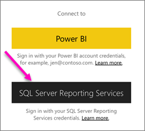
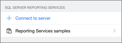

<properties 
   pageTitle="View on-premises reports and KPIs in the Power BI mobile apps"
   description="The Power BI mobile apps offer live, touch-enabled mobile access to your on-premises business information in SQL Server Reporting Services and Power BI Report Server."
   services="powerbi" 
   documentationCenter="" 
   authors="maggiesMSFT" 
   manager="erikre" 
   backup=""
   editor=""
   tags=""
   qualityFocus="no"
   qualityDate=""/>
 
<tags
   ms.service="powerbi"
   ms.devlang="NA"
   ms.topic="article"
   ms.tgt_pltfrm="NA"
   ms.workload="powerbi"
   ms.date="05/16/2017"
   ms.author="maggies"/>

# View on-premises reports and KPIs in the Power BI mobile apps

Applies to:

|  |  |  |  |
|:------------------------|:----------------------------|:----------------------------|:----------------------------------------|
| iPhones | iPads | Android phones | Android tablets |

The Power BI mobile apps deliver live, touch-enabled mobile access to your on-premises business information in Power BI Report Server and SQL Server 2016 Reporting Services (SSRS). 

 

## First things first

**The mobile apps are where you view Power BI content, not where you create it.**

-  You and other report creators in your organization [create Power BI reports with Power BI Desktop, then publish them to the Power BI Report Server](reportserver-quickstart-powerbi-report.md) web portal. 
-  You [create Reporting Services mobile reports](https://msdn.microsoft.com/library/mt652547.aspx) with SQL Server 2016 Enterprise Edition Mobile Report Publisher and publish them to the [Reporting Services web portal](https://msdn.microsoft.com/library/mt637133.aspx).  
-   You create [KPIs right in the web portal](https://msdn.microsoft.com/library/mt683632.aspx), organize them in folders, and mark your favorites so you can find them easily. 

Then in the Power BI mobile apps, connect to up to five report servers to view the Power BI reports and KPIs, organized in folders or collected as favorites. 

## Explore samples in the mobile apps without a server connection

Even if you don't have access to a Reporting Services web portal, you can still explore the features of Reporting Services mobile reports and KPIs. 

1. Tap the global navigation button  in the upper-left corner, then tap the gear icon in the upper right .

2.  Tap **Reporting Services samples**, then browse to interact with the sample KPIs and mobile reports.

    

## Connect to an on-premises server

You can view on-premises Power BI reports, Reporting Services mobile reports, and KPIs in the Power BI mobile apps. 

1.  On your mobile device, open the Power BI app.

2.  If you haven't signed in to Power BI yet, tap **SQL Server Reporting Services**.

    

2.  If you've already signed in to the Power BI app, tap the global navigation button , then tap the gear icon  in the upper-right.

    Tap **Connect to server**.

    

4. Fill in the server address and your user name and password. Use this format for the server address:

     `http://<servername>/reports`

     OR

     `https://<servername>/reports`
     
     > [AZURE.NOTE] Include **http** or **https** in front of the connection string.

    

5.    (Optional) Under **Advanced options**, you can give the server a friendly name, if you'd like.

5.  Now you see the server in the left navigation bar--in this example, called "power bi report server."

    

## View Power BI reports and KPIs in the Power BI app

Power BI reports, Reporting Services mobile reports, and KPIs are displayed in the same folders they're in on the Reporting Services web portal. 

- Tap a Power BI report to open and interact with it in the Power BI app.

    

- Tap a KPI to see it in focus mode.

    

## View your favorite KPIs and reports

You can mark KPIs and reports as favorites on the web portal, and then view them in one convenient folder on your mobile device, along with your Power BI favorite dashboards.

-  Tap **Favorites**.

    
   
    Your favorite KPIs and reports from the web portal are all on this page, along with Power BI dashboards in the Power BI service:

    

## Remove a connection to a report server

1. At the bottom of the left navigation bar, tap **Settings**.
2. Tap the server name you don't want to be connected to.
3. Tap **Remove Server**.

## Next steps
 
- [Get started with Power BI](powerbi-service-get-started.md)  
- Questions? [Try asking the Power BI Community](http://community.powerbi.com/)