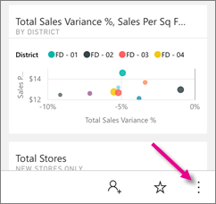
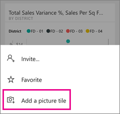

<properties 
   pageTitle="Create picture tiles with your iPhone app"
   description="You can add any picture on your iPhone to any dashboard you own in the Power BI mobile app for iOS. Learn how."
   services="powerbi" 
   documentationCenter="" 
   authors="maggiesMSFT" 
   manager="mblythe" 
   backup=""
   editor=""
   tags=""
   qualityFocus="no"
   qualityDate=""/>
 
<tags
   ms.service="powerbi"
   ms.devlang="NA"
   ms.topic="article"
   ms.tgt_pltfrm="NA"
   ms.workload="powerbi"
   ms.date="06/21/2016"
   ms.author="maggies"/>

# Create picture tiles with your iPhone app (Power BI for iOS)

You can add any picture on your iPhone to any dashboard you own in the Power BI mobile app for iOS. Power BI adds the picture as the last tile in the dashboard, on your iPhone, and adds it to the lower-right corner of the dashboard in the Power BI service. Everyone who can see your dashboard can see the picture on the dashboard. In the Power BI service, you can move it anywhere you want on the dashboard.

## Create a picture tile

1.  Open a [dashboard in the iPhone app](powerbi-mobile-dashboards-in-the-iphone-app.md). You need to have Edit permissions for this dashboard.

2.  Tap the ellipsis to open the dashboard menu.

    

3.  Tap **Add a picture tile**.

    

4.  Allow Power BI to access the camera or your camera roll. 

4.  Select a picture from your camera roll, or take a new picture.

    

5.  Type a title, if you want one, and tap **Add**.

6.  It may take a little time to upload the image. You can continue exploring your other dashboards and reports in Power BI while you wait.

6.  You see a notification that the picture is ready. Tap the notification to go to the dashboard. Scroll down to the end of the dashboard to see the picture. 

Picture tiles act the same as other tiles on your iPhone. You can:  

 - Open them in focus mode.
 - [Annotate and share them](powerbi-mobile-annotate-and-share-a-tile-from-the-iphone-app.md) in email. 

### See also

- [Get started with the iPhone app for Power BI](powerbi-mobile-iphone-app-get-started.md)
- [Get started with Power BI](powerbi-service-get-started.md)
- Questions? [Try asking the Power BI Community](http://community.powerbi.com/)
