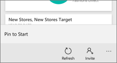

<properties
   pageTitle="Pin a Power BI tile or dashboard to the Start screen"
   description="Pin a Power BI tile dashboard to the Start screen from the Power BI mobile app"
   services="powerbi"
   documentationCenter=""
   authors="maggiesMSFT"
   manager="mblythe"
   editor=""
   tags=""
   qualityFocus="no"
   qualityDate=""/>

<tags
   ms.service="powerbi"
   ms.devlang="NA"
   ms.topic="article"
   ms.tgt_pltfrm="NA"
   ms.workload="powerbi"
   ms.date="03/31/2016"
   ms.author="maggies"/>

# Pin a Power BI tile or dashboard to the Start screen from the Power BI mobile app

You can pin Power BI tiles and dashboards to the Windows Start screen from the Power BI mobile app as *live tiles*, so you see all your critical metrics at a glance. When you add multiple tiles from the same dashboard, they're added to a single tile on the Start screen. When you tap the tile on the Start screen, the tile or dashboard opens in the Power BI mobile app for Windows 10.

## Pin tiles to your Start screen from a dashboard as one live tile

1. In the Power BI mobile app for Window 10, open a dashboard, then tap a tile to open it in focus mode.
2. Tap **Pin to start**.

    

3. When asked **Do you want to pin this tile to Start?** tap **Yes**.

4. Tap the back arrow to go back to the dashboard.

5. Scroll to another tile and tap the ellipsis.

6. This time, tap **Add to Live Tile**, and it's added to the same live tile.

    

7. Go to your device Start screen to see the live tile.

## Pin a dashboard to your Start screen as a live tile

There are two ways to pin a dashboard to your Start screen as a live tile.

-   On the dashboards home page, right-click or press and hold a dashboard, then tap **Pin to Start**.

    

-   On a dashboard, tap the ellipsis and tap **Pin to Start**.

    

Go to your device Start screen to see the live tile.

### See also  
[Download the Power BI mobile app for Windows 10](http://go.microsoft.com/fwlink/?LinkID=526478) from the Windows Store  
[Get started with the Power BI mobile app for Windows 10](powerbi-mobile-win10phone-app-get-started.md)  
[Get started with Power BI](powerbi-service-get-started.md)
