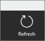

<properties 
   pageTitle="Refresh the Power BI for Windows app"
   description="Refresh the Power BI for Windows app"
   services="powerbi" 
   documentationCenter="" 
   authors="maggiesMSFT" 
   manager="mblythe" 
   editor=""
   tags=""/>
 
<tags
   ms.service="powerbi"
   ms.devlang="NA"
   ms.topic="article"
   ms.tgt_pltfrm="NA"
   ms.workload="powerbi"
   ms.date="10/15/2015"
   ms.author="maggies"/>

# Refresh the Power BI for Windows app  

Every time you start or return to the Microsoft Power BI for Windows app, it automatically refreshes all the data -- in the home page, the dashboards, and the reports.

You can also refresh everything from wherever you are in the app -- from the home page, a dashboard, or a report. Again, wherever you refresh, you refresh all the data in the app.

The app refreshes with the data in [Power BI](http://powerbi.com), not necessarily in the data sources. 

1.  Swipe down from the top of the screen or up from the bottom to show the app bars.

    On a non-touch screen, tap the ellipsis (**...**) in the lower-right corner of the app.

2.  In the lower-right corner, tap Refresh.  
    

>**Important:**  
>-   Each time the app refreshes, whether you started it or it was automatic, the app saves the data in the app cache until the next refresh.   
>-   When you uninstall or upgrade the app, that clears the cache.

More about the [Power BI for Windows app](powerbi-service-windows-app-get-started.md).  