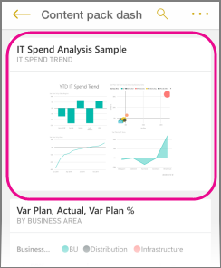

<properties 
   pageTitle="View report page tiles in the iPhone app"
   description="Read about viewing and interacting with live report tiles in a dashboard in the Power BI mobile app for iOS on your iPhone."
   services="powerbi" 
   documentationCenter="" 
   authors="maggiesMSFT" 
   manager="mblythe" 
   backup=""
   editor=""
   tags=""
   qualityFocus="no"
   qualityDate=""/>
 
<tags
   ms.service="powerbi"
   ms.devlang="NA"
   ms.topic="article"
   ms.tgt_pltfrm="NA"
   ms.workload="powerbi"
   ms.date="06/23/2016"
   ms.author="maggies"/>

# View report page tiles in the iPhone app (Power BI for iOS)

When you [create a dashboard](powerbi-service-dashboards.md) in the Power BI service, you add individual visuals from Power BI reports as tiles on the dashboard. You can also [pin a whole Power BI report page as a live tile](powerbi-service-pin-a-live-tile-to-a-dashboard-from-a-report.md). You can view these report tiles in the Power BI app for the iPhone.

1.  When you open a [dashboard in the iPhone app](powerbi-mobile-dashboards-in-the-iphone-app.md), you see a small image of the report.

    

2. Tap the tile. The pinned live report page opens the report in landscape mode. 

    

-   Tap the **X** to close the tile and return to the dashboard.

### See also

[Tiles in the iPhone app](powerbi-mobile-tiles-in-the-iphone-app.md)

[Get started with the iPhone app for Power BI](powerbi-mobile-iphone-app-get-started.md)

[Get started with Power BI](powerbi-service-get-started.md)
