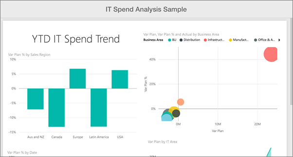

<properties 
   pageTitle="View report page tiles in the Power BI mobile app for Windows 10"
   description="View report page tiles in the Power BI mobile app for Windows 10"
   services="powerbi" 
   documentationCenter="" 
   authors="maggiesMSFT" 
   manager="mblythe" 
   backup=""
   editor=""
   tags=""
   qualityFocus="no"
   qualityDate=""/>
 
<tags
   ms.service="powerbi"
   ms.devlang="NA"
   ms.topic="article"
   ms.tgt_pltfrm="NA"
   ms.workload="powerbi"
   ms.date="02/23/2016"
   ms.author="maggies"/>

# View report page tiles in the Power BI mobile app for Windows 10

When you [create a dashboard](powerbi-service-dashboards.md) in the Power BI service, you add individual visuals from Power BI reports as live tiles on the dashboard. You can also [pin a whole Power BI report page as a live tile](http://blogs.msdn.com/b/powerbi/archive/2015/12/10/power-bi-weekly-service-update-1210.aspx#reportpin). You can view these report tiles in the Power BI mobile app for Windows 10.

1.  When you open a [dashboard in the Power BI mobile app for Windows 10](powerbi-mobile-dashboards-in-the-win10phone-app.md), you see a small image of the report.

    

2. Tap the tile. The pinned report page opens in landscape mode. 

    

3.   Tap the back arrow or the back button to close the tile and return to the dashboard.

### See also

[Tiles in the Power BI mobile app for Windows 10](powerbi-mobile-tiles-in-the-win10phone-app.md)

[Get started with the Power BI mobile app for Windows 10](powerbi-mobile-win10phone-app-get-started.md)

[Get started with Power BI](powerbi-service-get-started.md)
