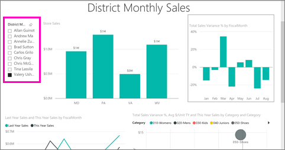

<properties 
   pageTitle="Reports in the Power BI app for Android phones"
   description="Learn about viewing reports in the Power BI mobile app for Android phones. You create reports in the Power BI service and Power BI Desktop, then interact with them in the mobile apps."
   services="powerbi" 
   documentationCenter="" 
   authors="maggiesMSFT" 
   manager="erikre" 
   backup=""
   editor=""
   tags=""
   qualityFocus="no"
   qualityDate=""/>
 
<tags
   ms.service="powerbi"
   ms.devlang="NA"
   ms.topic="article"
   ms.tgt_pltfrm="NA"
   ms.workload="powerbi"
   ms.date="03/02/2017"
   ms.author="maggies"/>

# Reports in the Power BI app for Android phones

A report is an interactive view of your data, with visuals representing different findings and insights from that data. You [create and customize reports](powerbi-service-create-a-new-report.md) in the Power BI service [(https://powerbi.com)](https://powerbi.com) or in [Power BI Desktop](powerbi-desktop-report-view.md). When you create reports in Power BI Desktop, you can create [a version of the report optimized for phones](powerbi-mobile-view-phone-report.md).

Then you view and interact with those reports in the [Android app](powerbi-mobile-android-app-get-started.md).

## Open a Power BI report

- On the main page of the Power BI mobile app, tap Reports, then the report you want to open. 

     

    Here you see the same Power BI reports  and Excel workbooks that you have in the Power BI service.

- On a dashboard, tap the ellipsis (**...**) on a tile > **Open Report**.

    

    The report opens in landscape mode.

    

     > [AZURE.NOTE]  Not all tiles can open in a report. For example, tiles you create by asking a question in the Q&A box don't open reports when you tap them. 

## View reports optimized for your phone 

Some Power BI report authors create a report layout optimized for phones. If a report page has a phone layout, then when you go to that page, it opens in portrait view.

Read more about [reports optimized for phone view](powerbi-mobile-view-phone-report.md).

## See other pages in a Power BI report

-   Swipe from one side or the other, or 

-   Tap the Pages icon  in the lower-right corner, then tap a page name. 

## Cross-filter and highlight a Power BI report page

-   Tap a value in a chart.

    

    Tapping the red "030-Kids" bubble in the bubble chart highlights related values in the other charts. Because the column chart in the upper-right shows percentages, some highlighted values are larger than the total values, and some are smaller. 

## Use slicers to filter the report page

When designing a report in the Power BI service [(https://powerbi.com)](https://powerbi.com), it's good to [add slicers to a report page](powerbi-service-tutorial-slicers.md). Then when you or your colleagues view your reports on your mobile devices, you can use the slicers to filter the page.

-   Select a value in a slicer on the report page.

    

## See also

- [View and interact with Power BI reports optimized for your phone](powerbi-mobile-view-phone-report.md)
- [Create a version of a report optimized for phones](powerbi-desktop-create-phone-report.md)
- Questions? [Try asking the Power BI Community](http://community.powerbi.com/)
