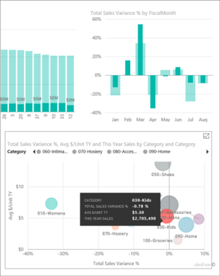

<properties 
   pageTitle="Reports in the Android app"
   description="Reports in the Power BI app for Android phones"
   services="powerbi" 
   documentationCenter="" 
   authors="maggiesMSFT" 
   manager="mblythe" 
   editor=""
   tags=""
   qualityFocus="no"
   qualityDate=""/>
 
<tags
   ms.service="powerbi"
   ms.devlang="NA"
   ms.topic="article"
   ms.tgt_pltfrm="NA"
   ms.workload="powerbi"
   ms.date="03/29/2016"
   ms.author="maggies"/>

# Reports in the Power BI app for Android phones

A report is an interactive view of your data, with visuals representing different findings and insights from that data. You [create and customize reports](powerbi-service-create-a-new-report.md) in the Power BI service [(https://powerbi.com)](https://powerbi.com).

Then you view and interact with those reports in the [Android app](powerbi-mobile-android-app-get-started.md).

## Open a Power BI report

1.   On a dashboard, tap the ellipsis (**...**) on a tile > **Open Report**.

    

    Or tap the tile to open it in focus mode, then tap the Open Report icon .

The report opens in landscape mode.

>**Note**: Not all tiles can open in a report. For example, tiles you create by asking a question in the Q&A box don't open reports when you tap them. 

## See other pages in a Power BI report

-   Tap the tabs at the bottom of the page. 

## Cross-filter and highlight a Power BI report page

-   Tap a value in a chart.

    

    Tapping the red "030-Kids" bubble in the bubble chart highlights related values in the other charts. Because the column chart in the upper-right shows percentages, some highlighted values are larger than the total values, and some are smaller. 

## Use slicers to filter the report page

When designing a report in the Power BI service [(https://powerbi.com)](https://powerbi.com), you can [add slicers to a report page](powerbi-service-tutorial-slicers.md). Then when you or your colleagues view your reports on your mobile devices, you can use the slicers to filter the page.

-   Select a value in a slicer on the report page.

    

### See also

[Get started with the Android app](powerbi-mobile-android-app-get-started.md)

