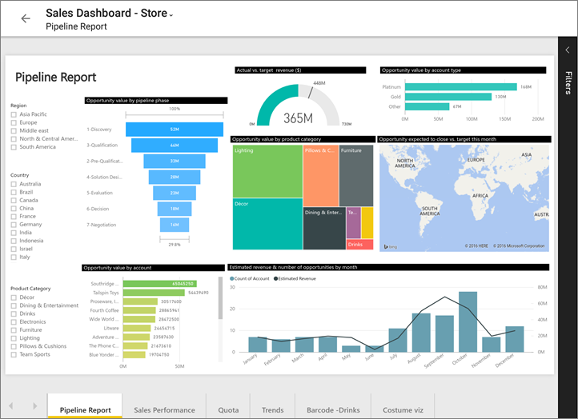

<properties 
   pageTitle="Reports in the Power BI app for Android tablets"
   description="Learn about viewing reports in the Power BI mobile app for Android tablets. You create reports in the Power BI service, then interact with them in the mobile apps."
   services="powerbi" 
   documentationCenter="" 
   authors="maggiesMSFT" 
   manager="erikre" 
   backup=""
   editor=""
   tags=""
   qualityFocus="no"
   qualityDate=""/>
 
<tags
   ms.service="powerbi"
   ms.devlang="NA"
   ms.topic="article"
   ms.tgt_pltfrm="NA"
   ms.workload="powerbi"
   ms.date="03/10/2017"
   ms.author="maggies"/>

# Reports in the Power BI mobile app for Android tablets

A report is an interactive view of your data, with visuals representing different findings and insights from that data. You [create and customize reports](powerbi-service-create-a-new-report.md) in the Power BI service [(https://powerbi.com)](https://powerbi.com).

Then you view and interact with those reports in the [Android app](powerbi-mobile-android-tablet-app-get-started.md).

## Open a Power BI report

1. On the main page of the Power BI mobile app, tap Reports. 

     

    Here you see the same Power BI reports  and Excel workbooks that you have in the Power BI service.

2. Tap the report you want to open.
    The report opens in landscape mode.

    

    To see other pages, tap the report page names along the bottom of the report.

## Cross-filter and highlight a Power BI report page

-   Tap a value in a chart.

    

    Tapping the red "030-Kids" bubble in the bubble chart highlights related values in the other charts. Because the column chart in the upper-right shows percentages, some highlighted values are larger than the total values, and some are smaller. 

## Use slicers to filter the report page

When designing a report in the Power BI service [(https://powerbi.com)](https://powerbi.com), it's good to [add slicers to a report page](powerbi-service-tutorial-slicers.md). Then when you or your colleagues view your reports on your mobile devices, you can use the slicers to filter the page.

-   Select a value in a slicer on the report page.

    

## See also

- [Get started with the Android app](powerbi-mobile-android-tablet-app-get-started.md)
- Questions? [Try asking the Power BI Community](http://community.powerbi.com/)
