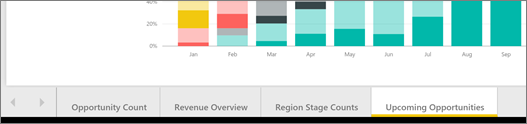
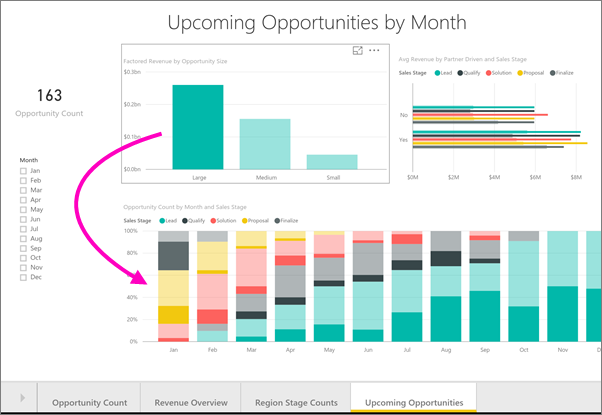
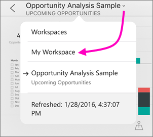

<properties 
   pageTitle="Reports in the Power BI mobile apps"
   description="Learn about viewing and interacting with reports in the Power BI mobile apps on your phone or tablet. You create reports in the Power BI service or Power BI Desktop, then interact with them in the mobile apps. "
   services="powerbi" 
   documentationCenter="" 
   authors="maggiesMSFT" 
   manager="erikre" 
   backup=""
   editor=""
   tags=""
   qualityFocus="no"
   qualityDate=""/>
 
<tags
   ms.service="powerbi"
   ms.devlang="NA"
   ms.topic="article"
   ms.tgt_pltfrm="NA"
   ms.workload="powerbi"
   ms.date="06/08/2017"
   ms.author="maggies"/>

# Reports in the Power BI mobile apps

Applies to:

|  |  |  |  |  |
|:------------------------|:----------------------------|:----------------------------|:----------------------------------------|:-----------------|
| iPhones | iPads | Android phones | Android tablets | Windows 10 devices |

A Power BI report is an interactive view of your data, with visuals representing different findings and insights from that data. You [create and customize reports](powerbi-service-create-a-new-report.md) in [Power BI Desktop](powerbi-desktop-report-view.md). You can even create [a version of the report optimized for phones](powerbi-mobile-view-phone-report.md) in Power BI Desktop. You publish those reports to the Power BI service [(https://powerbi.com)](https://powerbi.com) or [Power BI Report Server](powerbi-mobile-iphone-kpis-mobile-reports.md).  

Then you interact with those reports in the Power BI mobile apps.

## Open a Power BI report in the mobile app

Power BI reports are stored in different places in the mobile app, depending on where you got them. They can be in Apps, Shared with me, Workspaces (including My Workspace), or on a report server. Sometimes you go through a related dashboard to get to a report, and sometimes they're listed.

-   From a dashboard, tap the ellipsis (...) in the upper-right corner of  a tile > **Open report**.

    

    The report opens in landscape mode.

    

    > [AZURE.NOTE]  Not all tiles have the option to open in a report. For example, tiles created by asking a question in the Q&A box don't open reports when you tap them. 

## View reports optimized for phones 

Power BI report authors can create a report layout specifically optimized for phones . If you're viewing a report on a phone, when you go to a report page with a phone layout it opens in portrait view.

Read more about [reports optimized for phone view](powerbi-mobile-view-phone-report.md).

## See other pages in a Power BI report

- On a tablet, you can see the tabs for the pages along the bottom of the report, as in the Power BI service.

    

-   On a phone, swipe side to side or tap the pages icon  > tap a page. 

## Use slicers to filter a report page

When designing a report in the Power BI service [(https://powerbi.com)](https://powerbi.com), keep in mind that on a phone, you can't see the Filters pane, but you can [see slicers on a report page](powerbi-service-tutorial-slicers.md). Add slicers to a report so you and your colleagues can use the slicers to filter the page on a phone.

-   When you select a value in a slicer on the report page, it filters the other visuals on the page.

    

    In this illustration, the slicer is filtering the column chart to show only July values.

## Cross-filter and highlight a Power BI report page

When you select a value in a visual, it doesn't filter the other visuals. It highlights the related values in the other visuals.

-   Tap a value in a visual.

    

    Tapping the Large column in one visual highlights related values in the other visuals. 

## Sort a visual in a tablet or iPad

-  Tap the chart, tap the ellipsis (**...**) and tap the field name.

    

-   To reverse the sort order, tap the ellipsis (**...**) again, then tap the same field name again.

## Drill down and up in a visual in a tablet or iPad

If a report author has added this capability to a visual, in an iPad or a tablet you can drill down in a visual to see the values that make up one part of it. You [add drill down to a visual](powerbi-service-drill-down-in-a-visualization.md) in Power BI Desktop or the Power BI service. 

> [AZURE.NOTE]  Currently, drill-down doesn't work on maps in the iPad.

-   Tap a visual. If it has up and down arrows in the upper corners , then you can drill down. To drill down on one value, tap the arrow in the upper-right corner, then tap a value in the visual &#151; in this case, the dark-blue FD-04 bubble.

    

-   To drill back up, tap the up arrow in the upper-left corner.

    

## Go back to My Workspace

*   Tap the arrow next to the report name > tap **My Workspace**.

    

## See also

- [View and interact with Power BI reports optimized for your phone](powerbi-mobile-view-phone-report.md)
- [Create a version of a report optimized for phones](powerbi-desktop-create-phone-report.md)
- Questions? [Try asking the Power BI Community](http://community.powerbi.com/)
