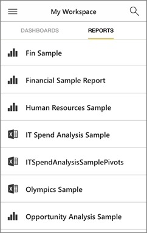

<properties 
   pageTitle="Reports in the iPhone mobile app"
   description="Learn about viewing and interacting with reports in the Power BI mobile app for iOS on your iPhone. You create reports in the Power BI service or Power BI Desktop, then interact with them in the mobile apps. "
   services="powerbi" 
   documentationCenter="" 
   authors="maggiesMSFT" 
   manager="erikre" 
   backup=""
   editor=""
   tags=""
   qualityFocus="no"
   qualityDate=""/>
 
<tags
   ms.service="powerbi"
   ms.devlang="NA"
   ms.topic="article"
   ms.tgt_pltfrm="NA"
   ms.workload="powerbi"
   ms.date="01/19/2017"
   ms.author="maggies"/>

# Reports in the iPhone mobile app

A report is an interactive view of your data, with visuals representing different findings and insights from that data. You [create and customize reports](powerbi-service-create-a-new-report.md) in the Power BI service [(https://powerbi.com)](https://powerbi.com) or in [Power BI Desktop](powerbi-desktop-report-view.md). When you create reports in Power BI Desktop, you can create [a version of the report optimized for phones](powerbi-mobile-view-phone-report.md). 

Then you view and interact with those reports in the [iPhone app (Power BI for iOS)](powerbi-mobile-iphone-app-get-started.md).

## Open a Power BI report

-   On your iPhone, in **My workspace** or in a group, tap Reports.

    

    You see Power BI reports and Excel workbooks together.

-   Or: On a dashboard, tap a tile to open it in focus mode, then tap the Open Report icon .

    

The report opens in landscape mode.

>**Note**: Not all tiles can open in a report. For example, tiles you create by asking a question in the Q&A box don't open reports when you tap them. 

## See other pages in a Power BI report

-   Swipe side to side, or tap the pages icon  > tap a page. 

## Cross-filter and highlight a Power BI report page

-   Tap a value in a chart.

    

    Tapping the red "030-Kids" bubble in the bubble chart highlights related values in the other charts. Because the column chart in the upper-right shows percentages, some highlighted values are larger than the total values, and some are smaller. 

## Use slicers to filter the report page

When designing a report in the Power BI service [(https://powerbi.com)](https://powerbi.com), you can [add slicers to a report page](powerbi-service-tutorial-slicers.md). Then when you or your colleagues view your reports on your mobile devices, you can use the slicers to filter the page.

-   Select a value in a slicer on the report page.

    

## Go back to My Workspace

*   Tap the arrow next to the tile name and tap **My Workspace**.

    

## See also

- [View and interact with Power BI reports optimized for your phone](powerbi-mobile-view-phone-report.md)
- [Create a version of a report optimized for phones](powerbi-desktop-create-phone-report.md)
- Questions? [Try asking the Power BI Community](http://community.powerbi.com/)
