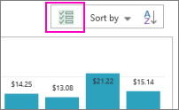
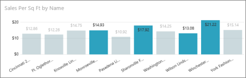
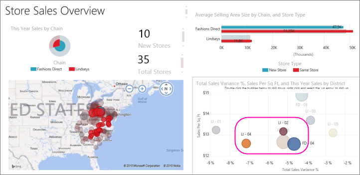
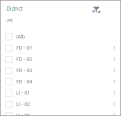
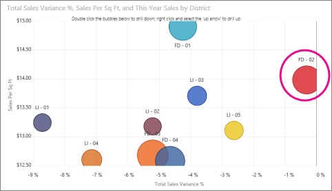
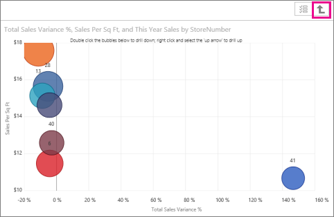

<properties pageTitle="Reports in the Power BI for Windows app" description="Reports in the Power BI for Windows app" services="powerbi" documentationCenter="" authors="v-anpasi" manager="mblythe" editor=""/>
<tags ms.service="powerbi" ms.devlang="NA" ms.topic="article" ms.tgt_pltfrm="NA" ms.workload="powerbi" ms.date="06/26/2015" ms.author="v-anpasi"/>
#Reports in the Power BI for Windows app
[← Power BI app for Windows](https://support.powerbi.com/knowledgebase/topics/75729-power-bi-app-for-windows)

A report is an interactive view of your data, with visualizations representing different findings and insights from that data. You [create and customize reports in http://powerbi.com](http://support.powerbi.com/knowledgebase/articles/425684-reports-in-power-bi).

Then you view and interact with those reports in the [Power BI for Windows app](http://support.powerbi.com/knowledgebase/articles/510917-get-started-with-the-power-bi-for-windows-app).

##Open a Power BI report
-   On the Windows app home page or the reports page, tap a report.
-   Or: On a dashboard, tap a tile and then tap the Reports icon.
    
	
    
    NOTE: Not all tiles can open in a report. For example, tiles you create by asking a question in the Q&A  box don't open reports when you tap them. They go back to the Q&A box. Also, to open the sample reports, you need to sign in to Power BI.

##See other pages in a Power BI report
-   Tap the arrows at the bottom of the page. 

##Sort a chart in a Power BI report
1.  Tap and hold, or right-click the chart. 
2.  Tap the down arrow next to **Sort by**, then tap the field name.

    
    
3.  To reverse the sort order, tap **A\>Z** or **Z\>A**. 

##Select more than one item in a chart
1.  Tap and hold, or right-click the chart. 
2.  Tap the multiselect icon in the upper-right corner of the chart.
    
    
    
3.  When the icon is grayed , you can select more than one column at a time.

    
    

##Cross-filter and highlight a Power BI report page
-   Tap a bar or column in a chart.
    
    
    
	Tapping the three bubbles in the bubble chart highlights related values in the other charts. Because the bar chart in the upper-right shows percentages, some highlighted values are larger than the total values and some are smaller. 

##Filter a Power BI report
You can always filter visualizations in a Power BI report, because you can use the fields in the visualization itself as filters. You can also filter whole pages in a report, if you or someone else has [added filters to the page](http://support.powerbi.com/knowledgebase/articles/464704-add-a-filter-to-a-visualization-in-a-report) in <http://powerbi.com/>. You can also add other fields to a visualization as filters in <http://powerbi.com/>. 

Expand the Filters pane, if it's collapsed.

When filtering fields, you can select check boxes for the values you want.

Or you can switch the filtering mode. Tap **Change filter type**  to select values using expressions instead.
-   Number fields offer expressions such as **is less than**, **is greater than**, **is not**, and **is blank**.
-   Text fields offer expressions such as **contains**, **doesn't start with**, and **is not**.

##Filter a visualization in a Power BI report

When you filter a visualization, such as a chart, you can always filter it by one of the fields in the chart. 

1.  In a dashboard, tap a tile and then tap Report  to open the report.
2.  Select a chart or other visualization on a report page and tap **Filters** in the upper-right corner to expand the Filters pane.
    
    
    
	You see a list of the fields in the visualization, and maybe other fields, if you added them in [http://powerbi.com/](http://powerbi.com/).
3.  Tap the name of the field to expand it, and select the values you want to filter.

##Filter a page in a Power BI report

You can only filter a whole page if you or someone else has added a filter to the page in [http://powerbi.com/](http://powerbi.com/).

1. In a dashboard, tap a tile and then tap Report  to open the report.
2. Without selecting any visualizations on the page, tap **Filters** in the upper-right corner.
    
    
3. If there are fields under the Page heading, you can set filters for the page.  
    If there are no fields in the Filters pane or you want other fields go to <http://powerbi.com/>, [add filters to the page](http://support.powerbi.com/knowledgebase/articles/464704-add-a-filter-to-a-visualization-in-a-report), and save the report.

##Drill down and up in a chart
You can drill down in some charts to see the values that make up one part of the chart. To [add drill down to a visualization](http://support.powerbi.com/knowledgebase/articles/467072-drill-down-in-a-visualization), edit the report in <http://powerbi.com/>.

-   Double-tap a bar, column, or other part of a chart to drill into the details for that part — in this case, the red **FD-02 **bubble.

    

-   To drill back up, tap and hold or right-click the chart, and tap the up arrow in the upper-right corner.

    

More about the [Power BI for Windows app](http://support.powerbi.com/knowledgebase/articles/510917-get-started-with-the-power-bi-for-windows-app).