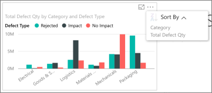

<properties 
   pageTitle="Reports on the iPad app"
   description="Reports on the iPad app (Power BI for iOS)"
   services="powerbi" 
   documentationCenter="" 
   authors="maggiesMSFT" 
   manager="mblythe" 
   backup=""
   editor=""
   tags=""
   qualityFocus="no"
   qualityDate=""/>
 
<tags
   ms.service="powerbi"
   ms.devlang="NA"
   ms.topic="article"
   ms.tgt_pltfrm="NA"
   ms.workload="powerbi"
   ms.date="02/23/2016"
   ms.author="maggies"/>
# Reports on the iPad app (Power BI for iOS)

A report is an interactive view of your data, with visualizations representing different findings and insights from that data. You [create and customize reports in Power BI](powerbi-service-reports.md).

Then you view and interact with reports on the [iPad app for Microsoft Power BI](http://go.microsoft.com/fwlink/?LinkId=522062) for iOS.

## Open reports from your dashboard

-   Tap **Reports** at the top of the app home page.

-   Or tap a tile on a dashboard, and tap **Open report**.

    >**Note**: Not all tiles can open in a report. For example, tiles created by asking questions with Q&A don't open reports.

## See other pages in the report

-   Tap the tabs at the bottom of the app.

## Cross-filter a report page

-   Tap a bar or column in a chart.

    

    Tapping the **Raw Materials** column in the lower chart highlights related values in the upper chart.

## Sort a chart

-  Tap the chart, tap the ellipsis (**...**) > **Sort by** and tap the field name.

    

To reverse the sort order, tap the **AZ** button.

## Drill down and up in a chart

Sometimes you can drill down in charts to see the values that make up one part of the chart. You can drill up and down in the iPad app, but you can't add it to a visualization. You can only [add drill down to a visualization](powerbi-service-drill-down-in-a-visualization.md) in a report in Power BI. 

>**Note:** Currently, drill-down doesn't work on maps in the iPad.

-   Tap a visual. If it has a down arrow in the upper-right corner, then you can drill down. Tap the arrow, then tap a value in the visual &#151; in this case, the **Oct** column.

    

-   To drill back up, tap the up arrow in the upper-left corner.

    

More about [the iPad app](powerbi-mobile-iphone-app-get-started.md) for Power BI.

