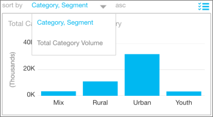

<properties 
   pageTitle="Reports on the iPad app (Power BI for iOS)"
   description="Reports on the iPad app (Power BI for iOS)"
   services="powerbi" 
   documentationCenter="" 
   authors="pcw3187" 
   manager="mblythe" 
   editor=""
   tags=""/>
 
<tags
   ms.service="powerbi"
   ms.devlang="NA"
   ms.topic="article"
   ms.tgt_pltfrm="NA"
   ms.workload="powerbi"
   ms.date="10/14/2015"
   ms.author="v-pawrig"/>
# Reports on the iPad app (Power BI for iOS)

[← iPad app (Power BI for iOS)](https://support.powerbi.com/knowledgebase/topics/77999-ipad-app-power-bi-for-ios)

A report is an interactive view of your data, with visualizations representing different findings and insights from that data. You [create and customize reports in Power BI](http://support.powerbi.com/knowledgebase/articles/425684-reports-in-power-bi).

Then you view and interact with reports on the [iPad app for Microsoft Power BI](http://support.powerbi.com/knowledgebase/topics/69272-ipad-app-for-power-bi) for iOS.

## Open reports from your dashboard

-   Tap **Reports** at the top of the app home page.

-   Or tap a tile on a dashboard, and tap **Open report**.

    >**NOTE**: Not all tiles can open in a report. For example, to open the sample reports, you need to sign in to Power BI. Also, tiles created from Salesforce or created with Q&A don't open reports.

## See other pages in the report

-   Swipe from side to side.

## Cross-filter a report page

-   Tap a bar or column in a chart.

    

    Tapping the Urban column in one chart highlights related values in the other charts. Because the % Unit Market Share YOY chart shows percentages, some highlighted values are larger than the total values and some are smaller. 

## Sort a chart

Tap the chart, then tap the down arrow next to **Sort by** and the field name.

To reverse the sort order, tap **asc** or **desc**.

## Select more than one item in a chart

Tap the chart, then tap the multiselect icon  in the upper-right corner of the chart.

When the icon is blue, you can select more than one column at a time.

## Drill down and up in a chart

Sometimes you can drill down in charts to see the values that make up one part of the chart. You can drill up and down in the iPad app, but you can't add it to a visualization. You can only [add drill down to a visualization](http://support.powerbi.com/knowledgebase/articles/467072-drill-down-in-a-visualization) in a report in Power BI. 

>**Note:** Currently, drill-down doesn't work on maps in the iPad.

-   Double-tap a bar, column, or other part of a chart to drill into the details for that part — in this case, the **Functional** columns.

    

-   To drill back up, with the chart selected tap the up arrow in the upper-right corner.

    

More about [the iPad app](http://support.powerbi.com/knowledgebase/articles/467172-the-ipad-app-for-power-bi-preview) for Power BI.

