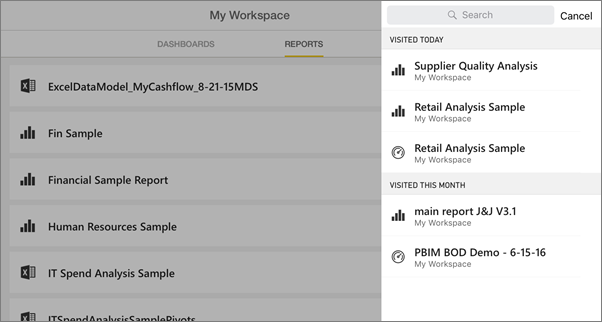
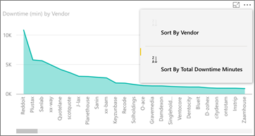
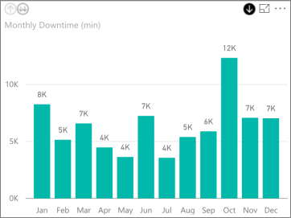
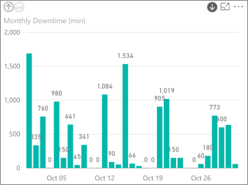
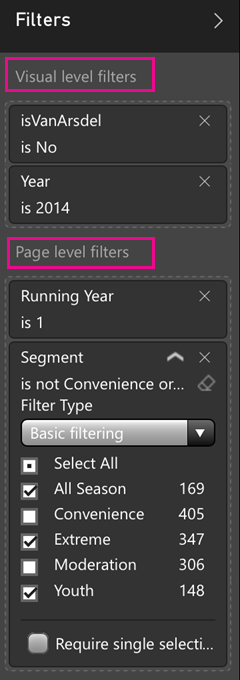

<properties 
   pageTitle="Reports on the iPad app"
   description="Learn about viewing reports in the Power BI mobile app for iOS on the iPad. You create reports in the Power BI service, then interact with them in the mobile apps."
   services="powerbi" 
   documentationCenter="" 
   authors="maggiesMSFT" 
   manager="mblythe" 
   backup=""
   editor=""
   tags=""
   qualityFocus="no"
   qualityDate=""/>
 
<tags
   ms.service="powerbi"
   ms.devlang="NA"
   ms.topic="article"
   ms.tgt_pltfrm="NA"
   ms.workload="powerbi"
   ms.date="10/10/2016"
   ms.author="maggies"/>
# Reports on the iPad app (Power BI for iOS)

A report is an interactive view of your data, with visualizations representing different findings and insights from that data. You [create and customize reports](powerbi-service-create-a-new-report.md) in the Power BI service [(https://powerbi.com)](https://powerbi.com).

Then you view and interact with reports on the [iPad app for Microsoft Power BI](http://go.microsoft.com/fwlink/?LinkId=522062) for iOS.

## Open reports

-   Tap **Reports** at the top of **My Workspace**.

-   Or tap a tile on a dashboard, and tap the report icon .

    >**Note**: Not all tiles can open in a report. For example, tiles created by asking questions with Q&A don't open reports.

-   Or tap the search icon  in the upper-right corner to search for it by name, or see the list of reports you've visited recently.

    

## See other pages in the report

-   Tap the tabs at the bottom of the app.

    

## Cross-filter a report page

-   Tap a bar or column in a chart.

    

    Tapping the **Raw Materials** column in the lower chart highlights related values in the upper chart.

## Sort a chart

-  Tap the chart, tap the ellipsis (**...**) and tap the field name.

    

-   To reverse the sort order, tap the **Sort by** arrow, then tap the same field name again.

## Drill down and up in a chart

Sometimes you can drill down in charts to see the values that make up one part of the chart. You can drill up and down in the iPad app, but you can't add it to a visualization. You can only [add drill down to a visualization](powerbi-service-drill-down-in-a-visualization.md) in a report in Power BI. 

>**Note:** Currently, drill-down doesn't work on maps in the iPad.

-   Tap a visual. If it has a down arrow in the upper-right corner, then you can drill down. Tap the arrow, then tap a value in the visual &#151; in this case, the **Oct** column.

    

-   To drill back up, tap the up arrow in the upper-left corner.

    

## Filter a Power BI report

You can always filter individual visuals in a Power BI report by using the fields in the visual itself as filters. You can also filter whole pages in a report, if you or the report creator has [added filters to the page](powerbi-service-add-a-filter-to-a-report.md) in the Power BI service ([https://powerbi.com](http://powerbi.com/)). In the Power BI service, you can also add other fields as filters for a specific visual. 

> **Note** If you don't have Edit permission for a report, you can change the filters, but you can't save those changes. 

1. In a report, expand the Filters pane.

    

    If the report creator has set page-level filters, when you select a visual you see *visual-level filters* for that visual, and *page-level filters* for the whole page.

    

2. Select check boxes for the values you want.

3. Or you can switch the filtering mode. Tap **Basic filtering** and select **Advanced filtering** to select values using expressions instead.

    

     Number fields offer expressions such as **is less than**, **is greater than**, **is not**, and **is blank**.

     Text fields offer expressions such as **contains**, **doesn't start with**, and **is not**.

       

4.  To add other fields to the Filters pane, go to the Power BI service ([https://powerbi.com](http://powerbi.com/)), [add filters to the page](powerbi-service-add-a-filter-to-a-report.md), and save the report.

## Go back to My Workspace

-  Tap the back arrow, or tap the report name > **My Workspace**.

    

### See also 

-  [Get started with the iPad app](powerbi-mobile-iphone-app-get-started.md) for Power BI.
- Questions? [Try asking the Power BI Community](http://community.powerbi.com/)

