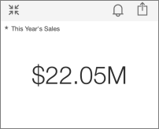
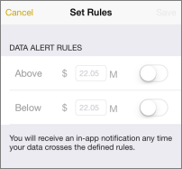
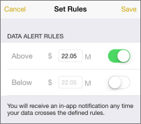
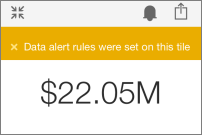

<properties 
   pageTitle="Set data alerts in the iPhone app (Power BI for iOS)"
   description="Set data alerts in the iPhone app (Power BI for iOS)"
   services="powerbi" 
   documentationCenter="" 
   authors="jastru" 
   manager="mblythe" 
   editor=""
   tags=""/>
 
<tags
   ms.service="powerbi"
   ms.devlang="NA"
   ms.topic="article"
   ms.tgt_pltfrm="NA"
   ms.workload="powerbi"
   ms.date="10/15/2015"
   ms.author="jastru"/>

# Set data alerts in the iPhone app (Power BI for iOS)  

In the iPhone app for Microsoft Power BI for iOS, you set alerts to notify you when data in your dashboards changes beyond limits you set. Alerts work for tiles featuring a single number. Only you can see the data alerts you set, even if you share a dashboard or a snapshot of a tile.

1.  Tap a number tile in dashboard to open it.  
    

2.  Tap the bell icon  to add an alert.  
    

3.  Type numbers to receive alerts above or below those values, or both.  
    

4.  Tap **Save**.

Data sources are often set to refresh daily, although someone can manually refresh them. When the data in the dashboard is refreshed, you'll receive an alert if the new value is above or below the number you set.

## See Also  
[Get started with the iPhone app for Power BI](http://support.powerbi.com/knowledgebase/articles/527036)  
[Get started with Power BI](http://support.powerbi.com/knowledgebase/articles/430814)  